# The brewery hardware

What the software in this repository is wired to. [kitt/README.md](kitt/README.md)
explains how `panp.py` behaves and [kitt/DASHBOARD.md](kitt/DASHBOARD.md) what the
gauges mean; this file is the physical side — what is powered from where, which
wire goes into which pin, and which box does which job.

Everything here was read off the running Pis, the code, and the photographs in
the [build thread](https://www.homebrewtalk.com/threads/brewery-dashboard.726917/),
then walked terminal by terminal with the owner in September 2026. The few
things not yet checked are marked **(confirm)** and listed again under
[Still to confirm](#still-to-confirm) at the end.

## The shape of it

The brewery splits into a hot side and a cold side that share almost nothing but
a room. The hot side is a three-vessel HERMS built to
[The Electric Brewery](https://shop.theelectricbrewery.com/) design; its control
panel is self-contained and documented there, and it touches the rest of this
system only through two temperature probes. The cold side — three fermenters, a
lagering keezer, a serving keezer with five taps — is where all the control
electronics live, and the KITT dash is the front panel for it.

```
                12 VDC 30 A supply ─┬─▶ dash boards (via power relays)
                                    ├─▶ fermenter heaters (via BrewPi relays)
                                    ├─▶ 12→24 V converter ─▶ glycol pumps (via BrewPi relays)
                                    ├─▶ 12→5 V converters ─▶ the two Pis
                                    └─▶ relay modules, PANP lamps

   HOT SIDE                         CONTROLS                        COLD SIDE
   ─────────                        ────────                        ─────────
   mash tun probe ──┐                                     ┌── 3× Arduino Uno ─── fermenter probe,
   HLT probe ───────┴─ 1-wire ──▶  brewpi Pi 4  ◀── USB ──┤   (BrewPi Remix)     heat relay, cool relay
                                    │  │  │               └── Arduino Uno ─── left switch pod
                                    │  │  └── 5 relays ──▶ flow meters
                                    │  └── serial ──▶ speedo, message centre, dummy3 F
                                    │ 2 GPIO lines (mode)
                                    ▼
   6 keezer probes ─ 1-wire ──▶  rpints Pi 4  ◀── USB ──┬── Arduino Uno ─── 5× SF800 flow meters
   3 lager probes ── 1-wire ──▶     │  │                └── Arduino Uno ─── right switch pod
                                    │  └── serial ──▶ tacho, dummy6, dummy3 E
                                    └── PANP buttons/lamps, dash power relays

   Tilt ×3 ──▶ TiltBridge ── WiFi ──▶ brewpi          Hue bridge ◀── WiFi ── rpints
```

Independent of all of it: a Johnson Controls A419 on each keezer holds the
temperature. The Pis only *watch* the keezers; they never control them.

## Block diagrams

The same system, five ways. GitHub renders these; the ASCII sketch above is the
fallback for anything that does not.

### Power

Everything on the 12 V side, from the wall to the loads. Fuse values are the
ones fitted; the contactors are the two D-1012s in the supply box.

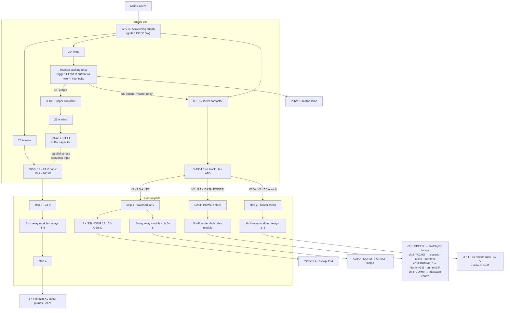
```mermaid
flowchart TB
  mains["Mains 120 V"] --> psu["12 V 30 A switching supply<br/>(gutted CCTV box)"]

  subgraph box["Supply box"]
    direction TB
    psu --> f3["3 A inline"] --> latch["HiLetgo latching relay<br/>trigger: POWER button via two Pi interlocks"]
    latch -- "NC output · 'master relay'" --> k1["D-1012 lower contactor"]
    latch -- "NC output" --> k2["D-1012 upper contactor"]
    psu --> k1 --> fb["D-1384 fuse block · 6 × ATO"]
    psu --> f25a["25 A inline"] --> mggi["MGGi 12→24 V boost<br/>15 A · 360 W"]
    k2 --> f25b["25 A inline"] --> cap["Belva BB1D 1 F<br/>buffer capacitor"]
    cap -. "parallel across<br/>converter input" .- mggi
  end
  latch --> plamp["POWER button lamp"]

  subgraph panel["Control panel"]
    direction TB
    fb -- "V1 · 7.5 A · 'P1'" --> s1["strip 1 · switched 12 V"]
    fb -- "V2 · 5 A · 'DASH POWER'" --> dp["DASH POWER block"]
    fb -- "V3 V4 V5 · 7.5 A each" --> s2["strip 2 · heater feeds"]
    mggi --> s3["strip 3 · 24 V"]
    s1 --> buck["2 × SSLHONG 12→5 V USB-C"]
    s1 --> lamprel["8-way relay module · ch 6–8"]
    dp --> r4["SunFounder 4-ch relay module"]
    s2 --> r6h["6-ch relay module · relays 1–3"]
    s3 --> r6c["6-ch relay module · relays 4–6"] --> s4["strip 4"]
  end

  buck --> pis["rpints Pi 4 · brewpi Pi 4"]
  lamprel --> lamps["AUTO · NORM · PURSUIT lamps"]
  r4 --> dashloads["ch 1 'SPEED' → switch pod lamps<br/>ch 2 'TACHO' → speedo · tacho · dummy6<br/>ch 3 'DUMMY3' → dummy3 E · dummy3 F<br/>ch 4 'COMM' → message centre"]
  r6h --> heat["3 × FTSs heater pads · 12 V<br/>cables H1–H3"]
  s4 --> pumps["3 × Penguin XL glycol pumps · 24 V"]
```

### Controllers and relays

The two Pis, the six Unos, and which relay module each one drives. Sensors are
in [Sensor buses](#sensor-buses) and the dash serial in
[Dash serial](#dash-serial).

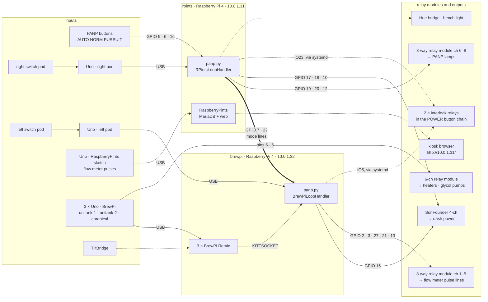
```mermaid
flowchart LR
  subgraph IN["inputs"]
    direction TB
    btns["PANP buttons<br/>AUTO NORM PURSUIT"]
    podR["right switch pod"] --> unoSR["Uno · right pod"]
    podL["left switch pod"] --> unoSL["Uno · left pod"]
    unoR["Uno · RaspberryPints sketch<br/>flow meter pulses"]
    unoF["3 × Uno · BrewPi<br/>unitank-1 · unitank-2 · chronical"]
    tb["TiltBridge"]
  end

  subgraph RP["rpints · Raspberry Pi 4 · 10.0.1.31"]
    direction TB
    panpR["panp.py<br/>RPintsLoopHandler"]
    rpdb["RaspberryPints<br/>MariaDB + web"]
  end
  subgraph BP["brewpi · Raspberry Pi 4 · 10.0.1.32"]
    direction TB
    panpB["panp.py<br/>BrewPiLoopHandler"]
    bpx["3 × BrewPi Remix"]
  end

  subgraph OUT["relay modules and outputs"]
    direction TB
    r8L["8-way relay module ch 6–8<br/>→ PANP lamps"]
    r4["SunFounder 4-ch<br/>→ dash power"]
    r8F["8-way relay module ch 1–5<br/>→ flow meter pulse lines"]
    r6["6-ch relay module<br/>→ heaters · glycol pumps"]
    interlock["2 × interlock relays<br/>in the POWER button chain"]
    hue["Hue bridge · bench light"]
    kiosk["kiosk browser<br/>http://10.0.1.31/"]
  end

  btns -- "GPIO 5 · 6 · 16" --> panpR
  unoSR -- USB --> panpR
  unoR -- USB --> rpdb
  unoSL -- USB --> panpB
  unoF -- USB --> bpx
  tb -.-> bpx
  bpx -- "KITTSOCKET" --> panpB
  panpR == "GPIO 7 · 22<br/>mode lines" ==> panpB

  panpR -- "GPIO 19 · 20 · 12" --> r8L
  panpR -- "GPIO 17 · 18 · 10" --> r4
  panpB -- "GPIO 16" --> r4
  panpB -- "GPIO 2 · 3 · 27 · 21 · 13" --> r8F
  unoF -- "pins 5 · 6" --> r6
  panpR -. "IO23, via systemd" .-> interlock
  panpB -. "IO5, via systemd" .-> interlock
  panpR -.-> hue
  rpdb -.-> kiosk
```

### Dash serial

Two buses per Pi, each through a TXS0108E level shifter with its `OE` on
GPIO 25, transmit only.

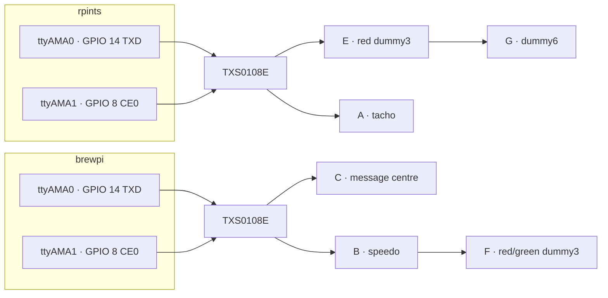
```mermaid
flowchart LR
  subgraph RP["rpints"]
    r0["ttyAMA0 · GPIO 14 TXD"]
    r1["ttyAMA1 · GPIO 8 CE0"]
  end
  subgraph BP["brewpi"]
    b0["ttyAMA0 · GPIO 14 TXD"]
    b1["ttyAMA1 · GPIO 8 CE0"]
  end
  r0 --> shR["TXS0108E"] --> E["E · red dummy3"] --> G["G · dummy6"]
  r1 --> shR --> A["A · tacho"]
  b0 --> shB["TXS0108E"] --> C["C · message centre"]
  b1 --> shB --> B["B · speedo"] --> F["F · red/green dummy3"]
```

### The POWER button

Why the button does nothing while a Pi is up, and why the system comes back on
its own after an outage.

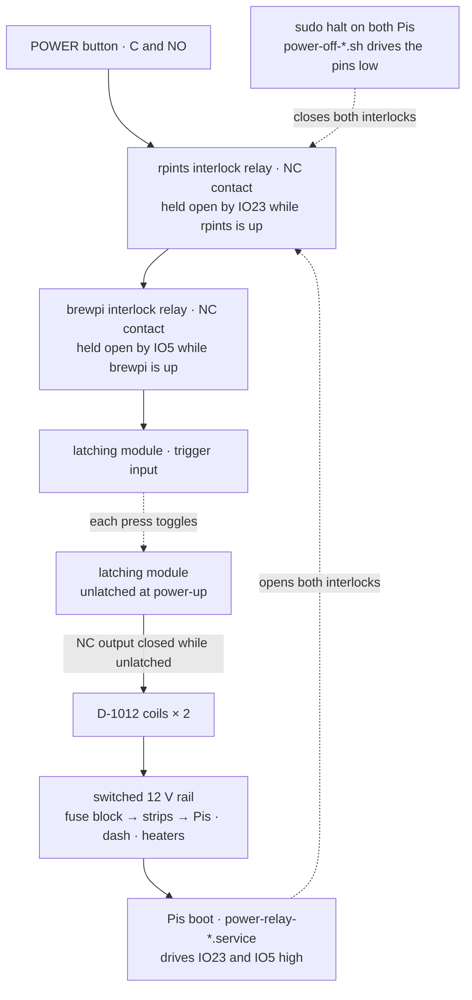
```mermaid
flowchart TB
  btn["POWER button · C and NO"] --> i1["rpints interlock relay · NC contact<br/>held open by IO23 while rpints is up"]
  i1 --> i2["brewpi interlock relay · NC contact<br/>held open by IO5 while brewpi is up"]
  i2 --> trig["latching module · trigger input"]
  trig -. "each press toggles" .-> latch["latching module<br/>unlatched at power-up"]
  latch -- "NC output closed while unlatched" --> coils["D-1012 coils × 2"]
  coils --> rail["switched 12 V rail<br/>fuse block → strips → Pis · dash · heaters"]
  rail --> boot["Pis boot · power-relay-*.service<br/>drives IO23 and IO5 high"]
  boot -. "opens both interlocks" .-> i1
  halt["sudo halt on both Pis<br/>power-off-*.sh drives the pins low"] -. "closes both interlocks" .-> i1
```

### Sensor buses

Every one-wire bus and what pulls it up.

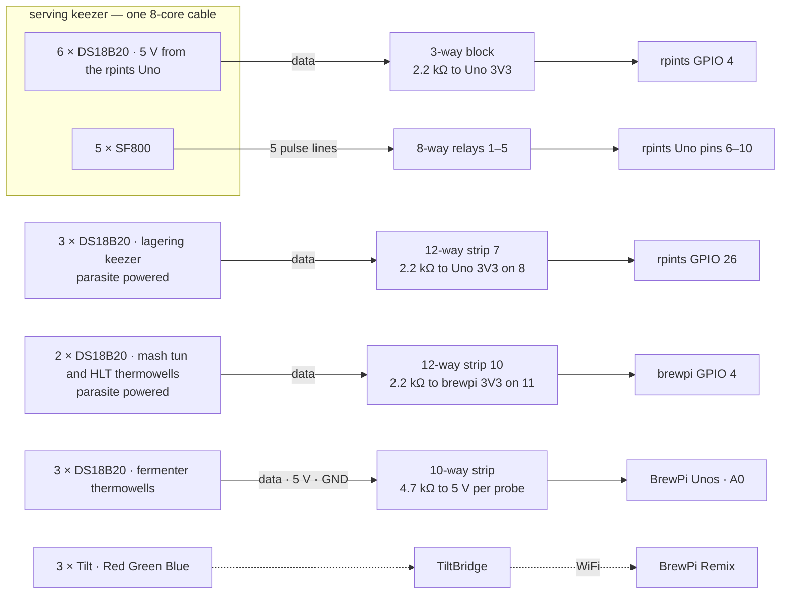
```mermaid
flowchart LR
  subgraph K["serving keezer — one 8-core cable"]
    kp["6 × DS18B20 · 5 V from the rpints Uno"]
    sf["5 × SF800"]
  end
  kp -- "data" --> k3["3-way block<br/>2.2 kΩ to Uno 3V3"] --> rp4["rpints GPIO 4"]
  sf -- "5 pulse lines" --> rel8["8-way relays 1–5"] --> unoR["rpints Uno pins 6–10"]

  lp["3 × DS18B20 · lagering keezer<br/>parasite powered"] -- "data" --> s12a["12-way strip 7<br/>2.2 kΩ to Uno 3V3 on 8"] --> rp26["rpints GPIO 26"]
  hp["2 × DS18B20 · mash tun and HLT thermowells<br/>parasite powered"] -- "data" --> s12b["12-way strip 10<br/>2.2 kΩ to brewpi 3V3 on 11"] --> bp4["brewpi GPIO 4"]

  fp["3 × DS18B20 · fermenter thermowells"] -- "data · 5 V · GND" --> s10["10-way strip<br/>4.7 kΩ to 5 V per probe"] --> unoF["BrewPi Unos · A0"]
  tilt["3 × Tilt · Red Green Blue"] -.-> tb["TiltBridge"] -. "WiFi" .-> bpx["BrewPi Remix"]
```

## Schematics

The wiring is also drawn as **KiCad schematics**, four A3 sheets in
[`schematics/`](schematics/), generated from the same facts as this file (see
[schematics/README.md](schematics/README.md) for how). Rendered copies:

| Sheet | Rendered | Covers |
| --- | --- | --- |
| 1 | [schematic-sheet1-power.svg](images/schematic-sheet1-power.svg) | the supply box and the `POWER` button circuit |
| 2 | [schematic-sheet2-rpints.svg](images/schematic-sheet2-rpints.svg) | rpints: PANP, dash power and flow-meter relays, keezer sensors, RaspberryPints Uno, right pod, serial to the tacho and dummies |
| 3 | [schematic-sheet3-brewpi.svg](images/schematic-sheet3-brewpi.svg) | brewpi: relay drives, hot-side probes, serial to the message centre and speedo, left pod, the three BrewPi controllers with heaters and pumps |
| 4 | [schematic-sheet4-dash.svg](images/schematic-sheet4-dash.svg) | strip 1 to the Pi converters, DASH POWER to the dash boards, the PANP switches on their strips |

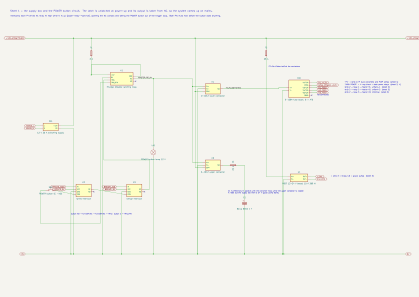

All four pass KiCad's electrical rules check with no errors. Where this file
and a sheet disagree, this file was walked with the owner and the sheet was
drawn from it, so fix the sheet.

## Power

Everything low-voltage runs from **one 30 A, 12 VDC switching supply**. It
started life as an InstallerCCTV **18-channel CCTV power distribution box**
(Amazon `B08XMKT1F8`, the 30 A variant of the listing, since discontinued): a
lockable, vented steel wall box holding a fan-cooled 360 W supply module and two
distribution boards with 18 PTC-fused screw-terminal outputs, 110–220 V AC in,
UL listed. **The distribution boards were stripped out** and only the enclosure
and the supply module kept. The box now holds, on DIN-style mounts above the
supply:

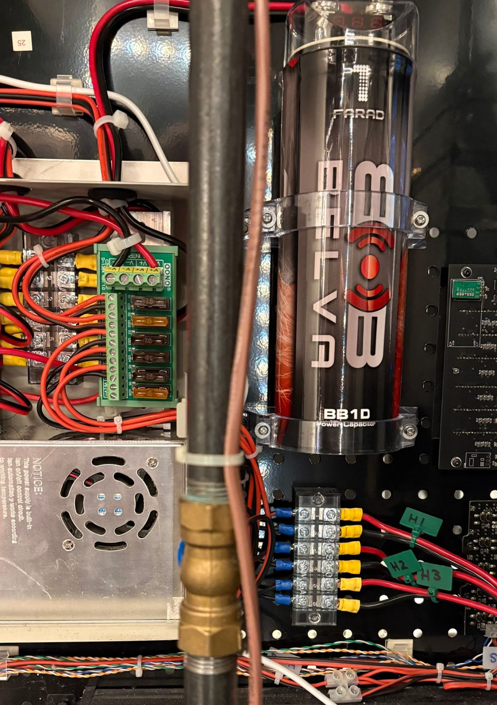

- **Two CZH-Labs D-1012 power relay modules** — single SPST-NO 30 A relay
  each, 12 V coil, with a red LED that lights when the coil is energised. Both
  coils are driven together by the latching module on the panel that the
  `POWER` button controls (see [The Power button](#the-power-button)), but they
  do different jobs: the **lower** contactor puts supply +12 V onto the D-1384
  fuse block and so onto the whole switched rail; the **upper** one connects
  the buffer capacitor described below, so that the capacitor is isolated when
  the system is off rather than left holding a charge across a dead rail.
- **A CZH-Labs D-1384 six-position fused distribution module** — 30 A in on a
  4-way terminal, six outputs each behind a medium ATO/ATC blade fuse (3 A as
  shipped, replaceable up to 10 A). Its +12 V input comes from the supply
  through the **lower D-1012 contactor**, and its 0 V goes straight back to the
  supply. The fused outputs leave the box as labelled cables:

  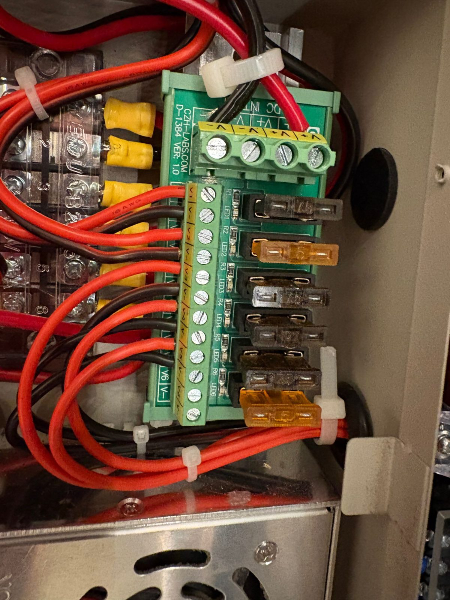

  | Channel | Fuse | Feeds |
  | --- | --- | --- |
  | `V1` | 7.5 A | `P1` — distribution strip 1: the two Pi buck converters and the PANP lamps |
  | `V2` | 5 A | `DASH POWER` — the 4-way block feeding the dash power relays: every dash board and the switch pods |
  | `V3` | 7.5 A | heater H1, via distribution strip 2 and relay 1 |
  | `V4` | 7.5 A | heater H2, via strip 2 and relay 2 |
  | `V5` | 7.5 A | heater H3, via strip 2 and relay 3 |
  | `V6` | 5 A | not connected — spare |

  The heaters' 0 V returns come back to the fuse block's `V−` terminals. The
  module lights a per-channel LED when a fuse has blown. The fuses double as
  isolators: pull `V2` and every dash board goes dark while the Pis keep
  running; pull `V1` and both Pis lose power — a hard cut, so halt them first.
  The `master power` cable to the latching module is **not** on this block: it
  has to be live while the contactors are open, so it is taken off the rail
  ahead of them.
- **Three inline ATO blade fuse holders**, all fed straight from the supply's
  +12 V, ahead of the contactors:

  | Fuse | Feeds |
  | --- | --- |
  | 3 A | the `master power` cable — the latching module and, through it, both D-1012 coils. Unswitched, which is what lets the `POWER` button work at all |
  | 25 A | the 12 V input of the MGGi 12→24 V converter. Unswitched too, so the 24 V bus is live whenever mains is; the pumps themselves are switched by the BrewPi relays. This holder is hidden behind the D-1012s |
  | 25 A | from the upper D-1012 contact to the +12 V terminal of the buffer capacitor |

- **Two 6-way barrier strips** for bussing 12 V.

**The buffer capacitor.** A **Belva BB1D 1 farad car-audio power capacitor**,
the kind with a voltmeter in the top, is mounted on the back of the workbench
above the heater block, and through the upper contactor and its fuse sits in
parallel across the 12 V input of the 12→24 V converter. It is there because
the three **Penguin Chillers XL 24 V glycol pumps**, 55 W each, pull enough on
start-up to dip the switching supply and make the dash boards flicker; the
capacitor rides out the dip. With the system off the contactor opens and the
capacitor's +12 V terminal floats, so it cannot keep anything alive.

The 24 V for the glycol pumps comes from an **MGGi 12→24 V boost converter**,
15 A, 360 W, non-adjustable 24 V out, in a potted die-cast aluminium case — the
finned module bolted on top of the supply box. Its output lands on distribution
strip 3 on the panel. The Cat5-coloured twisted pairs that pass below the box
are not part of it — they are the serial lines to the dash boards and the
switch pod ladder wires, routed past on their way to the panel.

From there 12 V is bussed across the back panel on more 6-way barrier strips
(600 V / 25 A rated) and fanned out with crimped ring and spade terminals.

Loads on the 12 V rail:

| Load | Notes |
| --- | --- |
| Dash boards | every ideegeniali board takes +12 V and GND on screw terminals; switched by the dash power relays |
| Fermenter heaters | SS Brewtech FTSs 12 V heating pads, one per fermenter, each behind its own 7.5 A fuse in the D-1384 and switched by relays 1–3 of the 6-way module |
| Glycol pumps | three Penguin Chillers XL pumps, 24 V, 55 W, 6 GPM, on 24 V from the MGGi 12→24 V boost converter, switched by the right three relays of the 6-way module |
| Raspberry Pis | through **two SSLHONG DC/DC buck converters** on the panel, 8–35 V in, 5 V 3 A out on USB-C, one per Pi, on the switched rail |
| Relay modules | the coil supply for the opto-isolated relay boards |
| PANP button lamps | 12 V, switched by the bottom three channels of the 8-way relay module |
| Switch pod lamps | 12 V, switched by channel 1 of the 4-channel module — lit in Pursuit only |

So the Pis *are* on the 12 V rail, via the two buck converters; the USB
adapters in the power strip in the 2023 photos were something else or since
removed. The Arduinos are powered over USB from their Pi.

### The Power button

`POWER` on the dash is the only PANP button that is not software, and it does
not switch any power itself. It is the trigger for a **HiLetgo 12 V bistable
self-locking relay module** at the bottom right of the control panel — press to
latch, press again to release — whose output drives the coils of the two 30 A
D-1012 contactors in the supply box. The lower contactor feeds the D-1384 fuse
block and so the whole switched rail, and everything downstream of it, the Pis
included, lives or dies with it; the upper one connects the buffer capacitor
across the 24 V converter's input at the same time.

```
  12 V rail ──▶ latching module COM ──▶ NC output ──▶ "master relay" cable ──▶ 2× D-1012 coils ──▶ switched 12 V
                       ▲                                     └──▶ POWER button lamp
                       │ trigger
  POWER button ──▶ rpints interlock (NC) ──▶ brewpi interlock (NC) ──┘
                   opens while rpints up     opens while brewpi up
```

**The 4-way terminal block** at the very bottom right is the junction:

| Terminal | Carries |
| --- | --- |
| 1 | +12 V in, from the supply box — the cable labelled **"master power"** |
| 2 | 0 V in, same cable |
| 3 | 0 V out |
| 4 | the latching module's **NC** output — the cable labelled **"master relay"**, to the two D-1012 coils and to the `POWER` button's lamp |

The master power pair feeds the latching module's own supply and also its `COM`
contact. **The output is taken from `NC`**, so with the module unlatched — its
state whenever the supply first comes up — the contactors are energised and the
system is on. Pressing `POWER` latches the module, opens `NC`, drops the
contactors and takes everything down; pressing it again releases the latch and
brings it all back. Unplugging the supply from the mains is the only way to
remove power from the latching module itself.

Between the button and the latching module's trigger input sit **two 5 V
single-channel relay modules, stacked one on the other, wired in series through
their `COM` / `NC` contacts** — one per Pi. Each is powered from its Pi's 5 V
and ground on the GPIO breakout HAT, and its `IN` is driven by:

- **`IO23` on rpints**, via `power-relay-rpints.service` (`raspi-gpio set 23 op pn dh`);
- **`IO5` on brewpi**, via `power-relay-brewpi.service` (`raspi-gpio set 5 op pn dh`).

Both are `oneshot` units that run early in boot, before `panp.py` starts, and
`panp.py` never touches these two pins. A high input energises the relay and
*opens* its NC contact, taking the `POWER` button out of the circuit. At halt,
`power-off-*.sh` in `/lib/systemd/system-shutdown/` drives the pin low as the
last act; the relay releases, the contact closes, and the button works again.

So the sequence, end to end:

1. Mains is applied to the supply box.
2. The latching module comes up unlatched, `NC` closed, and the two D-1012
   contactors close. 12 V reaches strip 1 and the two Pi buck converters.
3. Both Pis boot, and each powers its 5 V interlock relay module.
4. `power-relay-*.service` drives `IO23` on rpints and `IO5` on brewpi high.
   Either one alone breaks the series path from the `POWER` button to the
   latching module's trigger, so the button does nothing.
5. To make the button live again, `sudo halt` **both** Pis. Each shutdown
   script drops its pin, releasing its interlock.
6. Pressing `POWER` now latches the module, `NC` opens, the contactors drop,
   and the Pis and everything else lose 12 V.
7. The latching module is still powered from the master power pair, so a
   second press unlatches it and the system powers back up.
8. Unplugging the supply from the mains is what finally powers the latching
   module down.

That is the point of the interlocks: the boards write to EEPROM and the Pis
have SD cards, and neither likes having the power yanked. It is also why the
unit files are called *"Open … Power Relay"* — they open a contact, not a
circuit.

**After a mains outage the system comes back on its own**, because the output
is taken from `NC`. It used to be wired through `NO`, so the button had to be
pressed to power up, and a day without BrewPi control after an overnight outage
in July 2023 cost a batch of beer. Do not "tidy" this back to `NO`.

### The dash power relays

`rpints` owns three more relays that `panp.py` switches with the PANP modes.
They are **active low**: the pin is driven `0` to energise the relay and power
the load.

| GPIO | Header pin | `panp.py` name | Powered in |
| --- | --- | --- | --- |
| 10 | 19 | `lower_dash_power` | Norm, Pursuit |
| 18 | 12 | `upper_dash_power` | Norm, Pursuit |
| 17 | 11 | `sp_power` | Pursuit only |

Upper and lower dash are the two halves of the panel: the gauge cluster above
the bench and the strip of dummy3 boards and PANP buttons in the drawer front
below it. In Auto both are dark and only the message centre, which is on its
own relay driven from `brewpi`, stays lit. The third relay is the switch pods:
their lamps are bright enough to be a distraction, so they are only powered in
Pursuit, when the bench light is on and the dash is at full brightness anyway.

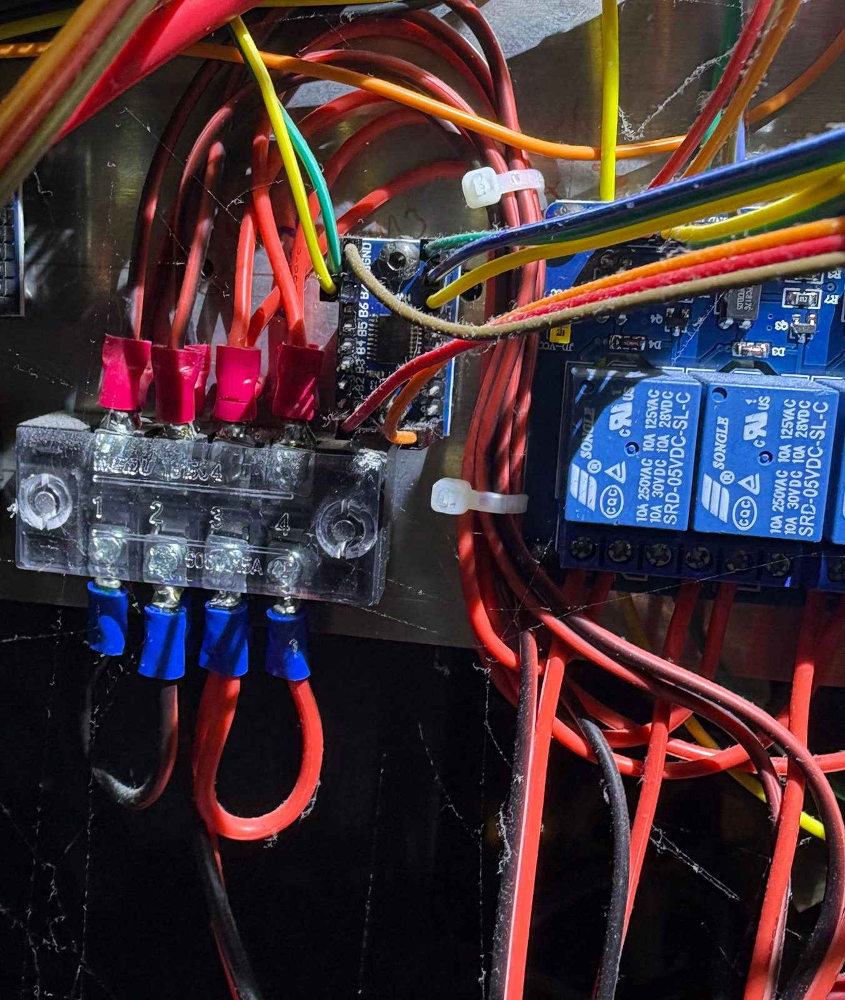

Physically all of this is one **SunFounder 4-channel relay module** under the
`rpints` Pi. Like the 8-way module it is **shared between the Pis**: three
inputs come from rpints and the fourth from brewpi. Coil supply is 5 V and
ground from the rpints HAT, and the jumper on the module ties the relay supply
to that 5 V. The module is low-level trigger — a `0` on the input closes the
contact — which is why the code drives these pins low to power a board and high
to cut it.

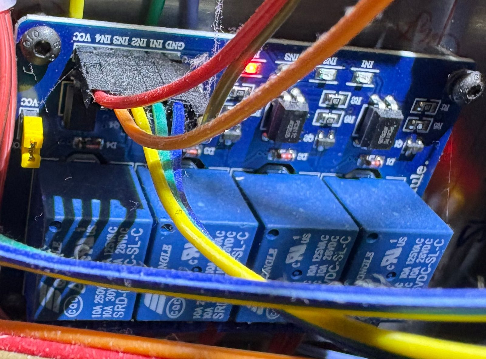

| Ch | Input | Driven by | `panp.py` name | Contact feeds cable | Which powers | On in |
| --- | --- | --- | --- | --- | --- | --- |
| 1 | `IN1`, blue | rpints `IO17` | `sp_power` | `SPEED` | +12 V / 0 V to **both switch pods** | Pursuit only |
| 2 | `IN2`, green | rpints `IO18` | `upper_dash_power` | `TACHO` | **speedo, tacho and dummy6** — the whole upper panel | Norm, Pursuit |
| 3 | `IN3`, yellow | rpints `MOSI`, which is GPIO 10 | `lower_dash_power` | `DUMMY3` | **both dummy3 boards**, via a run inside the bench | Norm, Pursuit |
| 4 | `IN4`, orange | **brewpi** `IO16` | `msgctr_power` | `COMM` | **the message centre** | always, while brewpi is up |

**The cable labels lie**, and deliberately so: `SPEED` and `TACHO` are left
from when the pods were powered all the time and the speedo had its own relay.
Read the table, not the tag.

The 12 V comes in on a **4-way barrier block** to the left of the module, on the
cable labelled `DASH POWER` from the D-1384 fuse block: terminal 3 is +12 V and
2 is 0 V, with 3 jumpered to 4 and 2 jumpered to 1. +12 V goes from there to
each relay's `COM`; the 0 V conductor of each of the four dash cables lands on
the 0 V side. Each relay's `NO` is the +12 V conductor of its cable.

## The two Raspberry Pis

Both are **Raspberry Pi 4 Model B** (rpints rev 1.1, brewpi rev 1.5), running
Raspberry Pi OS, reachable as `rpints.local` at `10.0.1.31` and `brewpi.local`
at `10.0.1.32`. They are
configured almost identically in `/boot/firmware/config.txt`:

```
dtoverlay=disable-bt        # frees the PL011 UART for /dev/ttyAMA0
enable_uart=1
dtoverlay=uart4             # second UART on GPIO 8/9 → /dev/ttyAMA1
dtoverlay=w1-gpio,gpiopin=4
```

with `rpints` adding a second one-wire bus, `dtoverlay=w1-gpio,gpiopin=26`,
because it has nine probes to read and they are in two different keezers.

### Serial to the dash

Each Pi has two UART transmit lines going to the dash, one per bus, and each
bus is strapped to the `COM` terminal of one or more boards. The boards are
polled at 57600 baud and never answer — `panp.py` only writes — so only TX and
ground are connected. The tacho and speedo *do* have a TX terminal, but it is
5 V and would damage a Pi input, and nothing listens to it.

| Pi | Device | UART | TX on | Boards on the bus |
| --- | --- | --- | --- | --- |
| rpints | `/dev/ttyAMA0` | UART0 | GPIO 14, pin 8 | `G` dummy6, `E` red dummy3 |
| rpints | `/dev/ttyAMA1` | UART4 | GPIO 8, pin 24 | `A` tacho |
| brewpi | `/dev/ttyAMA0` | UART0 | GPIO 14, pin 8 | `C` message centre |
| brewpi | `/dev/ttyAMA1` | UART4 | GPIO 8, pin 24 | `B` speedo, `F` red/green dummy3 |

The serial runs to the dash are twisted pairs pulled from old Cat5, one solid
core for `TX` and its striped mate for ground. The Pi's UARTs are 3.3 V. Between
them and the boards is a **TXS0108E 8-channel bidirectional level shifter**, one
per Pi, with the A side on the Pi's 3.3 V and the B side on 5 V, both taken
from the GPIO HAT along with ground, and its `OE` pin driven from **GPIO 25**
(header pin 22).

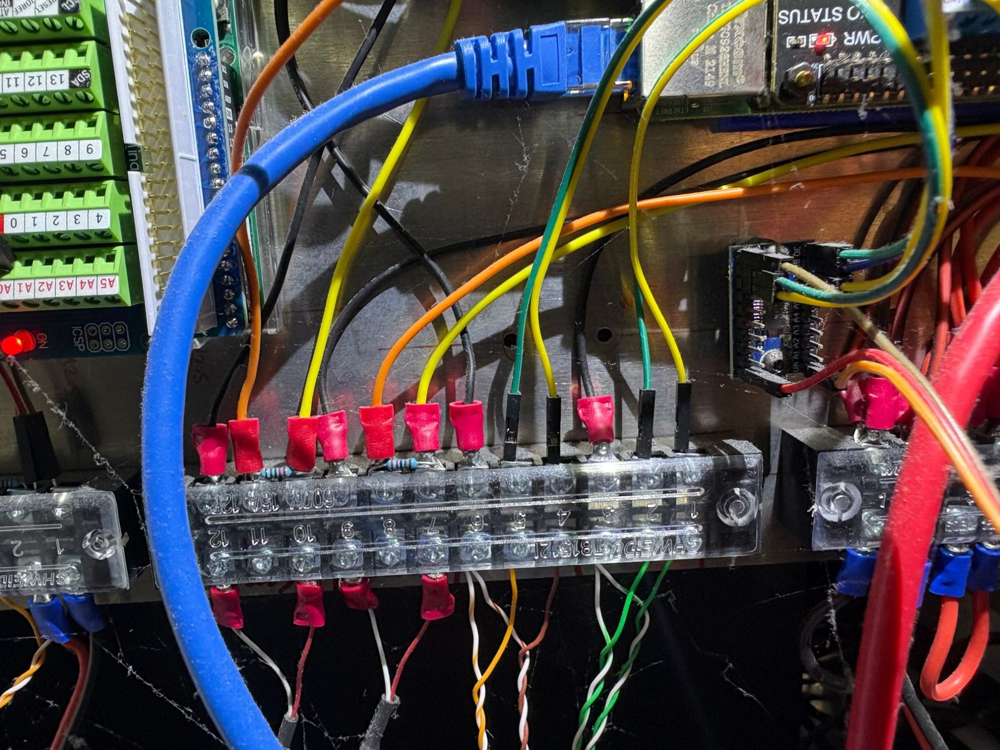

All four serial lines land on the right-hand half of the **12-way barrier strip
to the left of the `DASH POWER` block**, terminal 1 at the right. rpints uses
the right-hand shifter and terminals 1–3, brewpi the left-hand shifter and
terminals 4–6:

| Strip | Pi | Pi pin | Shifter | Field side, traced |
| --- | --- | --- | --- | --- |
| 1 | rpints | `TXD`, GPIO 14, `ttyAMA0` | one of `A6`/`B6`, `A7`/`B7` | solid green to the **red dummy3** `COM`, daisy-chained on to **dummy6** — the three lager temperatures and the six fill levels |
| 2 | rpints | `CE0`, GPIO 8, `ttyAMA1` | the other | solid green to the **tacho** `COM` — the six keezer probes and the selected reading |
| 3 | rpints | `GND` | | both green/white, ground for the two buses |
| 4 | brewpi | `TXD`, GPIO 14, `ttyAMA0` | yellow → `A7`/`B7` → yellow | solid brown to the **message centre** `COM` |
| 5 | brewpi | `CE0`, GPIO 8, `ttyAMA1` | blue → `A6`/`B6` → green | solid orange to the **speedo** `COM` and the **red/green dummy3** — the HLT and multifunction readings, and the fermenter temperatures |
| 6 | brewpi | `GND` | | brown/white and orange/white, ground for the two buses |
| | both | `IO25` | `OE` | |

The field side was traced. On the rpints rows the Pi side is taken from the
code, which the Pi's device tree confirms: `ttyAMA0` is UART0 on GPIO 14 and
`ttyAMA1` is UART4 on GPIO 8, and `panp.py` opens `ttyAMA0` for the dummies and
`ttyAMA1` for the tacho. The two rpints jumper colours are not reliably
recorded, so which of its shifter channels is which is left open **(confirm)**.
Only `TX` and ground are wired; the boards' `RX` is their `COM`, and their `TX`
terminals are left unconnected. `panp.py` raises the shifter's `OE` first thing
at startup and drops it in the SIGTERM handler, so the boards see nothing on the
bus while a Pi is booting or halting.

The left-hand half of the same strip is the two panel-side one-wire buses, one
per Pi, laid out as mirror images. Each is three terminals: data, a 3.3 V
supply terminal with a **2.2 kΩ 1 % pull-up** soldered across to the data
terminal, and ground. Only **two** field conductors arrive per bus, data and
ground, so the probes run in **parasite-power mode**: their `VDD` is tied to
ground at the probe end and they draw what they need through the data line and
the pull-up **(confirm)**.

| Strip | Field side | Panel side | Role |
| --- | --- | --- | --- |
| 7 | red | yellow, to rpints `IO26`; 2.2 kΩ across to 8 | one-wire data, the **three lager probes** |
| 8 | none | orange, to **`3V3` on the RaspberryPints Uno** | 3.3 V for the pull-up |
| 9 | white | black, to rpints `GND` | ground |
| 10 | red | yellow, to brewpi `IO4`; 2.2 kΩ across to 11 | one-wire data, the **mash and HLT probes** |
| 11 | none | orange, to brewpi `3V3` | 3.3 V for the pull-up |
| 12 | white | black, to brewpi `GND` | ground |

Both buses are pulled up to 3.3 V, which is what keeps the data lines inside
the Pis' GPIO range. Both of rpints's buses, this one and the keezer bus on the
3-way block, take their 3.3 V from the RaspberryPints Uno's `3V3` pin rather
than from the Pi's own rail, to keep the pull-up and probe load off the Pi's
3.3 V regulator; brewpi's bus uses the Pi's `3V3`. The resistor value was read
from the colour bands, red-red-black-brown-brown; a meter across 10 and 11
would confirm it.

The keezer probes are the exception: their bus does not come to this strip at
all. It arrives on the serving keezer's 8-way strip, is pulled up on the 3-way
block, and lands on rpints `IO4`.

### One-wire probes

All temperature probes on the Pi side are **DS18B20s** — the common stainless
steel waterproof probe on a 1 m three-core lead, red VCC, yellow data, black
ground (see [Parts](#parts)) — read through the kernel's `w1-gpio` driver at
`/sys/bus/w1/devices/28-*/w1_slave`. `panp.py` lists them by serial number, so
a replaced probe means editing the list.

| Pi | Bus | GPIO | Probes | Serials |
| --- | --- | --- | --- | --- |
| brewpi | 1 | 4 (pin 7) | mash tun, HLT | `28-012052b65be5`, `28-0120529d8f20` |
| rpints | 1 | 26 (pin 37) | 3 lager kegs | `28-3c01b556f6d0`, `28-3cdd04574813`, `28-3ce80457395a` |
| rpints | 2 | 4 (pin 7) | 6 serving keezer | `28-012052b92541`, `28-012058f936f3`, `28-012052ba8dab`, `28-012058fbceb5`, `28-012058fc2851`, `28-012052b426ca` |

On rpints the **lager bus is GPIO 26 and the keezer bus GPIO 4** — the reverse
of the order the overlays appear in `config.txt`. The kernel probed
`onewire@1a`, GPIO 26, first and numbered it `w1_bus_master1`, which is the
master that holds the lager probes; `dmesg` shows it, and the wiring agrees.
The keezer probes are the ones with `28-012…` serials, the lager probes
`28-3c…` — a different batch, which is a handy way to tell them apart.

### GPIO, `rpints`

| GPIO | Pin | Direction | Used for |
| --- | --- | --- | --- |
| 25 | 22 | out | serial level-shifter enable |
| 7 | 26 | out | `auto_mode_comm` → brewpi GPIO 7 |
| 22 | 15 | out | `normal_mode_comm` → brewpi GPIO 22 |
| 10 | 19 | out, active low | lower dash power relay |
| 18 | 12 | out, active low | upper dash power relay |
| 17 | 11 | out, active low | Pursuit relay (`sp_power`) |
| 19 | 35 | out | `AUTO` lamp |
| 20 | 38 | out | `NORM` lamp |
| 12 | 32 | out | `PURSUIT` lamp |
| 5 | 29 | in, pull-up | `AUTO` button |
| 6 | 31 | in, pull-up | `NORM` button |
| 16 | 36 | in, pull-up | `PURSUIT` button |
| 23 | 16 | out | Power disconnect relay (held high while up) |
| 4 | 7 | 1-wire | keezer probes, from the 3-way block |
| 26 | 37 | 1-wire | lager probes, from the 12-way strip |
| 14 | 8 | UART0 TX | dummy6 and red dummy3 |
| 8 | 24 | UART4 TX | tacho |

The PANP buttons are momentary contacts to ground; `panp.py` enables the
internal pull-ups and triggers on the falling edge with 50 ms of debounce, then
re-reads the pin 50 ms later before acting. The lamps are driven high to light:
each lamp GPIO goes to one of the bottom three channels of the 8-way relay
module, which switches 12 V from distribution strip 1 to the 12 V illuminated
pushbutton.

### GPIO, `brewpi`

| GPIO | Pin | Direction | Used for |
| --- | --- | --- | --- |
| 25 | 22 | out | serial level-shifter enable |
| 7 | 26 | in, pull-down | Auto mode, from rpints |
| 22 | 15 | in, pull-down | Norm mode, from rpints |
| 16 | 36 | out | message centre power relay (`msgctr_power`) |
| 2 | 3 | out, active high | flow meter 1 relay |
| 3 | 5 | out, active high | flow meter 2 relay |
| 27 | 13 | out, active high | flow meter 3 relay |
| 21 | 40 | out, active high | flow meter 4 relay |
| 13 | 33 | out, active high | flow meter 5 relay |
| 5 | 29 | out | Power disconnect relay (held high while up) |
| 4 | 7 | 1-wire | mash and HLT probes |
| 14 | 8 | UART0 TX | message centre |
| 8 | 24 | UART4 TX | speedo and red/green dummy3 |

GPIO 2 and 3 are the I²C pins; brewpi does not enable I²C so they are plain
outputs here. Note that GPIO 5 and 16 mean different things on the two Pis —
buttons on rpints, relays on brewpi — which is one reason to read `panp.py`
twice, once as each host.

`msgctr_power` is initialised to 0 and only ever written 0 again at shutdown.
It drives `IN4` of the SunFounder 4-channel module under the rpints Pi, which
is low-level trigger, so the message centre is powered the whole time brewpi's
`panp.py` is running and only drops when the Pi releases the pin at power-off.
That is what keeps the message centre lit in Auto while the rest of the dash is
dark.

### The link between the Pis

Two plain 3.3 V GPIO lines, same BCM numbers at both ends, ground common through
the shared supply. `rpints` drives them; `brewpi` reads them with pull-downs and
edge-detect callbacks.

| Mode | GPIO 7 (`auto_mode_comm`) | GPIO 22 (`normal_mode_comm`) |
| --- | --- | --- |
| Auto | 1 | 0 |
| Norm | 0 | 1 |
| Pursuit | 0 | 0 |

`brewpi` uses GPIO 7 to decide whether anyone is looking at the dash and GPIO 22
to pick dim or bright. `rpints` reads GPIO 22 back itself to set its own boards'
brightness, which is why `BrightnessHandler` takes a channel argument.

## The six Arduinos

All six are **Arduino Uno R3** boards (USB `2341:0043`), plugged into their Pi
over USB and given stable names by udev rules matching the board's serial
number, so the ports do not shuffle on reboot. Every one of them sits under an
HCDC screw-terminal breakout shield (see [Parts](#parts)), so all field wiring
lands on screw terminals rather than header pins.

| Pi | Hub port | udev name | USB serial | On the panel | Job | Firmware |
| --- | --- | --- | --- | --- | --- | --- |
| brewpi | 1.3 | `/dev/unitank-1` | `24230303537351E08050` | middle row, **left-most** of the three; relays 1 and 4 | fermentation controller | BrewPi Remix |
| brewpi | 1.1 | `/dev/unitank-2` | `24238313635351410240` | middle row, **middle** of the three; relays 2 and 5 | fermentation controller | BrewPi Remix |
| brewpi | 1.2 | `/dev/chronical` | `2423632373035110C052` | middle row, **right-most** of the three; relays 3 and 6 | fermentation controller | BrewPi Remix |
| brewpi | 1.4 | `/dev/switchpod` | `24238313535351F0D112` | bottom left, the **right-hand** of the two; orange twisted pair to the **left** pod | left switch pod ADC | [`kitt/switchpod`](kitt/switchpod/) |
| rpints | 1.3 | `/dev/rpints` | `85935333337351A01151` | middle row, right of centre, rainbow ribbon on pins 6–10 | flow meter pulse counter | RaspberryPints |
| rpints | 1.4 | `/dev/switchpod` | `24238313635351915202` | bottom left, the **left-most**; blue twisted pair to the **right** pod | right switch pod ADC | [`kitt/switchpod`](kitt/switchpod/) |

The two switch pod Unos are crossed: the left-most board on the panel serves
the right-hand pod, and the one beside it serves the left-hand pod. Follow the
twisted pair, blue to the right pod and orange to the left, not the position.

The hub port is the Pi 4's internal hub port as `/dev/serial/by-path` reports
it, which follows the physical USB socket rather than the board. Ports 1.3 and
1.4 share one stacked connector, 1.1 and 1.2 the other. The udev rules match on
the USB serial, so a replaced Uno keeps its socket but not its name until the
rule is edited.

The rules live in `/etc/udev/rules.d/` on each Pi and are not in this
repository. `panp.path` waits for `/dev/switchpod` to exist before starting
`panp.py`, which is what the naming is for.

## The dash

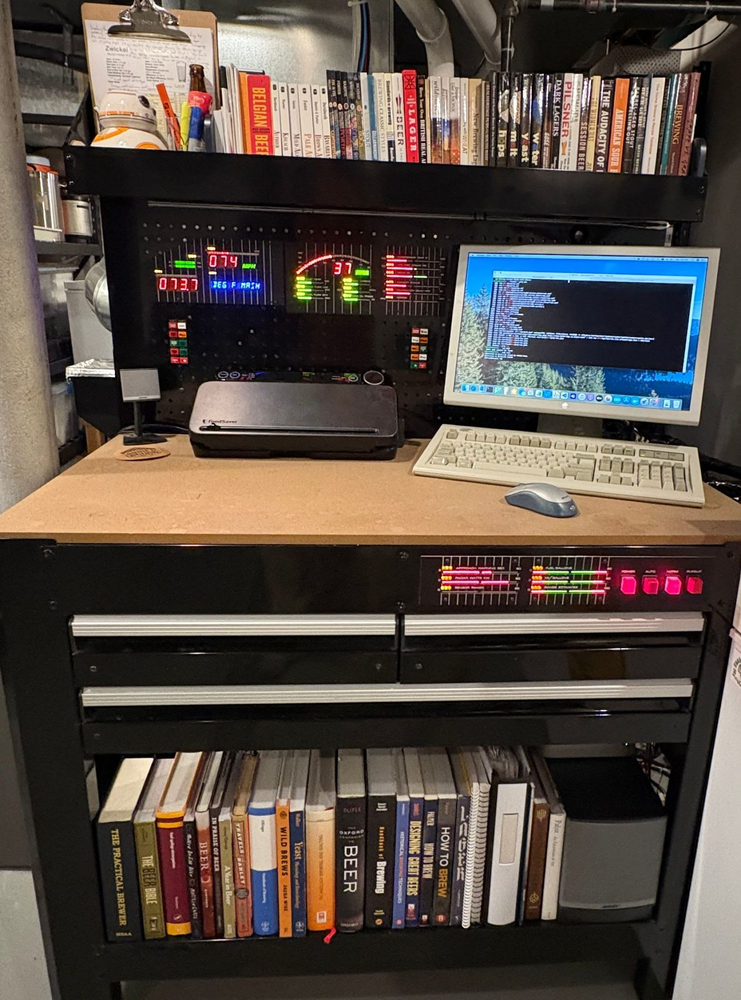

The whole dash is built into a **Kobalt 45 in × 36 in three-drawer hardwood
workbench** with a pegboard back. The gauge cluster and the two switch pods sit
in cut-outs Dremelled through the pegboard, with the face plates screwed to its
front; the drawer front below the top carries the strip of dummy3 boards and
the PANP buttons. Everything else — the supply box, the buffer capacitor, the
control panel, the backs of the display boards — hangs on the rear of the
pegboard, which is why the earlier photographs of the capacitor show the back
of dummy6 and the right switch pod beside it. Every display on the dash is an
[ideegeniali](https://www.ideegeniali.it/) board — Paolo Sancono's replicas of
KITT's season 2 dash electronics:

| Board | Address | Where |
| --- | --- | --- |
| tacho | `A` | upper, centre |
| speedo | `B` | upper, left |
| message centre 2.1 | `C` | upper, left — mounted on the back of the speedo |
| dummy3, all red | `E` | drawer front, left |
| dummy3, red/green | `F` | drawer front, centre |
| dummy6 | `G` | upper, right |
| PANP keys | — | drawer front, right; four illuminated pushbuttons |
| two switch pods | — | either side of the upper panel, below the gauges |

What the boards have in common: 12 V in on screw terminals, a `COM` screw
terminal for the serial bus, and an ATmega328 in a socket with a 6-pin ICSP
header beside it. The socket matters because the ATmega's internal EEPROM is the
only thing on the boards that wears out (see [CLAUDE.md](CLAUDE.md)), so a worn
board is fixed by pressing in a new chip. The protocol, and which host drives
which board, are in [kitt/README.md](kitt/README.md); everything about the
boards' internals is in the private repo and stays there.

The tacho and speedo also carry the inputs they would have in a car — speed
sensor, fuel sender, bar inputs — on their terminal strips. None of those are
used here; the 2023 firmware extensions exist precisely so the host can set
those displays instead.

One exception is wired deliberately. The speedo's four optocoupled warning
inputs, `BAR1`–`BAR4`, each light one of the green light bars behind the
`GUIDANCE` and `SYST. RDY` legends; Paolo meant them for turn signals and
dash warnings. On the speedo's own 12-way terminal block the four are
daisy-chained with white jumpers and fed +12 V by a red wire from the supply
terminal, so the firmware sees all four asserted and the legends are always
lit. They are the only lights on the dash the Pi does not control: to use them
as warning lamps, either move the strap to a Pi GPIO through the existing
optocouplers, or add a host register in the speedo firmware. The `KMH`/`MPH`
header beside the ICSP pins is Paolo's units jumper for the car speed input
and does nothing here.

The message centre and the speedo are the two boards that get hot: the speedo
has the most LEDs and the message centre is bolted to its back, all behind a
solid panel with no airflow. The speedo's habit of running dim, which heat
was suspected of, turned out to be EEPROM wear in its ATmega caused by the
firmware, fixed in September 2026 — see the EEPROM section of `CLAUDE.md`.
Nothing points at the heat doing harm, but the boards do run warm.

### PANP switches

The four `POWER` / `AUTO` / `NORM` / `PURSUIT` keys are Honeywell MICRO SWITCH
illuminated pushbuttons, marked `4A13BAA31`: a momentary contact on `C` / `NO` /
`NC` spade terminals rated 5 A at 250 VAC, and a separate lamp on terminals `5`
and `2`. The holder is rated 28 V max and the lamps fitted are **12 V**. Each
button uses **four wires** — `C`, `NO`, lamp `5`, lamp `2` — so the four buttons
fill two uxcell 8-core cables exactly, nothing shared on the way to the panel.
`PURSUIT` and `POWER` are mounted upside down relative to `AUTO` and `NORM`; the
buttons are symmetric from the front, so nothing shows. The yellow/green core of
each cable is used for `POWER`.

**Relamping.** Per Honeywell's Series 4 datasheet (Mouser `c30099-260707`),
the button pulls straight out of the housing from the front and the lamp
comes out with it, held in the button; the new lamp goes into the button and
the button pushes back in, no tools. The lamp is a **T-3¼ wedge base**: the
`31` in the part number means they shipped with a 28 V #656 or #152, and the
12 V lamps fitted are the #161 equivalent. **But `4A13B` is the housing "with
provision for locked button"**: if the locking mounting clip is fitted, it
holds the button in and the datasheet says such units cannot be relamped from
the front — the mounting clip must be slid off from behind the panel first.
If a button will not pull out with a firm straight pull, that is why; do not
force it.

**Fault log.** 2026-09-21: the `NORM` lamp went dark intermittently while
GPIO 20 was high, relay 7's indicator lit and +12 V present at its `NO`
terminal; pressing keys or moving the desk brought it back and jiggling the
cable did nothing. So the fault is at the key — a wedge lamp loose in its
socket, or the lamp spades — not the Pi, the relay or the wiring.

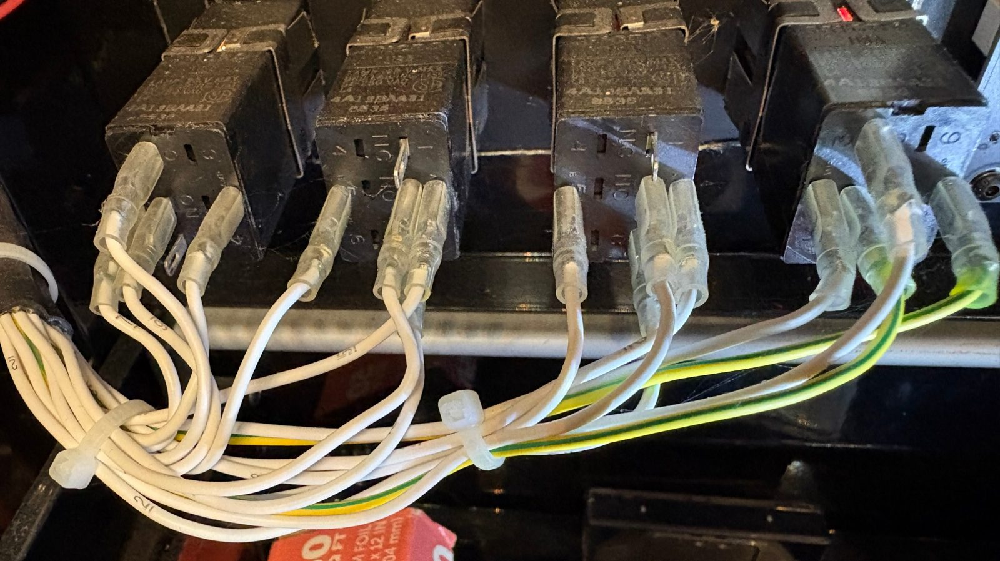

The cables land on the **lower two 8-way barrier strips** at the right-hand edge
of the control panel, numbered 1 at the bottom:

**Lower strip** (tagged `PURS`, `AUTO`, `NORM` on the cable tie):

| Pos | Wire | Goes to |
| --- | --- | --- |
| 1 | `POWER` `NO` (yellow/green) | the interlock chain, then the latching module's trigger — see [The Power button](#the-power-button) |
| 2 | `POWER` `C` | the other side of that chain |
| 3 | `POWER` lamp +12 V | the "master relay" line, so the lamp is lit whenever the contactors are |
| 4 | `POWER` lamp 0 V | 0 V |
| 5 | `AUTO` `NO` | rpints `IO5`, purple |
| 6 | `NORM` `NO` | rpints `IO6`, blue |
| 7 | `PURSUIT` `NO` | rpints `IO16`, green |
| 8 | `C` common | jumpered to middle strip 1 |

Note the colours: on the button side `AUTO` is purple, `NORM` blue and `PURSUIT`
green, but on the lamp relay inputs below the same three colours run the other
way, purple for `PURSUIT` and green for `AUTO`. Trace, don't trust the colour.

**Middle strip**:

| Pos | Wire | Goes to |
| --- | --- | --- |
| 1 | `C` common | jumpered from lower 8 |
| 2 | `C` common | jumpered from 1, to rpints `GND` |
| 3 | `AUTO` lamp +12 V | 8-way relay module, relay 8 `NO` (red) |
| 4 | `NORM` lamp +12 V | relay 7 `NO` (brown) |
| 5 | `PURSUIT` lamp +12 V | relay 6 `NO` (black) |
| 6 | lamp 0 V | jumpered from 7 |
| 7 | lamp 0 V | jumpered from 8 |
| 8 | lamp 0 V | in from distribution strip 1, terminal 3 |

The three software buttons' `C` contacts are commoned to the Pi's ground
through lower 8 → middle 1 → middle 2, so a press pulls the `IO` pin down
against its internal pull-up, which is the falling edge `panp.py` watches for.

The lamps are 12 V, so the Pi drives them through the **bottom three channels
of the 8-way relay module**. +12 V from distribution strip 1 terminal 6 goes to
relay 6 `COM` and is jumpered on to relays 7 and 8; each `NO` returns to the
middle strip as that lamp's +12 V line. The inputs are high-level trigger, so a
high on the pin lights the lamp:

| Relay | Input from | Lamp |
| --- | --- | --- |
| 6 | rpints `IO12`, purple | `PURSUIT` |
| 7 | rpints `IO20`, blue | `NORM` |
| 8 | rpints `IO19`, green | `AUTO` |

### Switch pods

Each pod is ten pushbuttons on a **resistive ladder** — one signal wire whose
voltage depends on which button is down. It goes to `A0` of its own Uno with a
3k3 pull-up to 5 V; the Uno bins the ADC reading into a position 0–9 and sends
it up USB as one digit per line. Wiring, thresholds and the calibration method
are in [kitt/switchpod/README.md](kitt/switchpod/README.md).

The **right** pod's Uno is on `rpints` and chooses what the tacho digits show;
the **left** pod's is on `brewpi` and chooses the speedo's lower display or
toggles a flow meter. Both Unos are on the control panel, bottom left. Each pod
has two connections to the panel: the signal-and-ground pair to its Uno, and a
+12 V / 0 V pair on the cable labelled `SPEED` from channel 1 of the 4-channel
dash power module. The pods' LEDs are internal and run from that 12 V: **yellow
and green are on whenever the pod is powered, red lights while a button is
pressed**. Because channel 1 is `sp_power`, low only in Pursuit, the pods are
dark in Auto and Norm — the buttons still work, only the lamps are off.

## Hot side

A three-vessel electric HERMS to The Electric Brewery's design — HLT, mash tun,
boil kettle, two pumps, HERMS coil in the HLT — with its own control panel doing
all the heating control. That panel is documented by its designer and is
deliberately not described here.

The only connection to the rest of this system is **two DS18B20 probes**, one in
the mash tun and one in the HLT, on `brewpi`'s one-wire bus. They are read every
second by `panp.py`, nothing else, and they drive:

- the `MPH` digits and the bargraph above them — HLT temperature, always;
- the lower multifunction display when `SILENT MODE` or `TEAR GAS` is selected —
  mash or HLT respectively.

Both probes sit in **stainless steel thermowells** fitted to the mash tun and
the HLT, so the DS18B20s themselves stay dry and can be pulled without draining
a vessel.

## Cold side

### Fermenters

Three SS Brewtech conicals: two **Unitanks** and one **Chronical**. Each has its
own temperature control loop with a **heater** and a **glycol cooling coil**
with its own pump, and each is run by its own **BrewPi Remix** controller: one
Uno on `brewpi` per fermenter, three instances of the Remix script in
`/home/brewpi/{unitank-1,unitank-2,chronical}/`, three web front-ends under
`/var/www/html/`.

The three controllers are configured identically, read live off the Arduinos:

| | Pin | BrewPi role |
| --- | --- | --- |
| DS18B20 in the fermenter | `A0` (one-wire) | chamber temperature |
| heat relay | `5` (Act 1) | chamber heater |
| cool relay | `6` (Act 2) | chamber cooler |
| free | `2` (Act 3), `10` (Act 4) | — |

The shield profile is Remix's "I²C" one, which puts one-wire on `A0` rather than
the legacy `A4`. There is a single probe per fermenter and it is registered as
the *chamber* sensor, so BrewPi runs in what is effectively fridge-constant
mode with the setpoint applied directly to the wort — the Unitank's thermowell
*is* the chamber. Probe addresses, for the record: `28BD2057047A3C27` on
unitank-1, `28EACCED582001EE` on unitank-2, `283213C85820014B` on the chronical.

The three probes do not go to the Unos directly. They land on a **10-way
barrier strip to the left of the unitank-1 Uno**, three terminals per
fermenter with the tenth spare, and short jumpers run from there to each Uno's
screw shield. Each group is data, supply and ground, with a **4.7 kΩ 1 %
pull-up** from data to supply soldered across the strip. Unlike the two Pi
buses these run at **5 V** from the Uno, so the standard DS18B20 pull-up value
is used rather than the 2.2 kΩ on the 3.3 V buses.

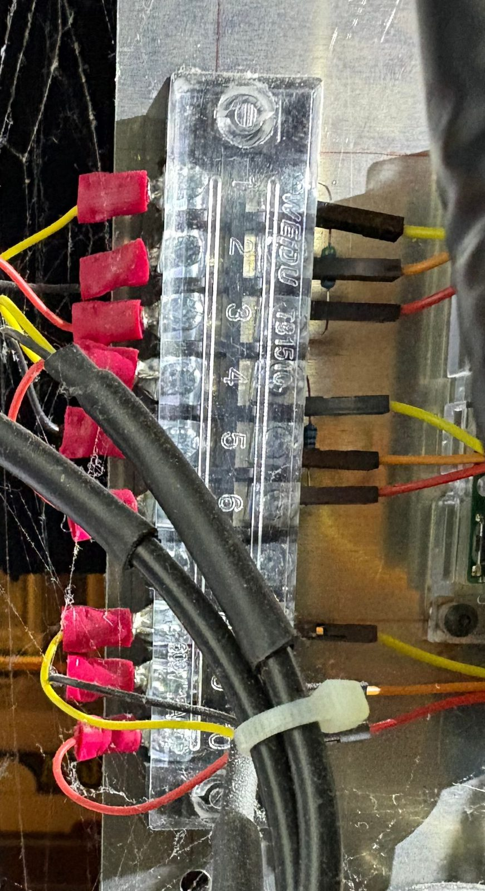

| Pos | Field side | To the Uno | Role |
| --- | --- | --- | --- |
| 1–3 | yellow, red, black | `A0`, `5V`, `GND` | **unitank-1** probe: data with 4.7 kΩ to supply, supply, ground |
| 4–6 | yellow, red, black | `A0`, `5V`, `GND` | **unitank-2** probe, likewise |
| 7 | | | not connected |
| 8–10 | yellow, red, black | `A0`, `5V`, `GND` | **chronical** probe, likewise |

On the field side the probe leads keep their colours — red supply, yellow data,
black ground. The jumper colours on the Uno side do not follow them, so trace
rather than trust a colour there.

The heat and cool outputs go to the ANMBEST 6-channel relay module on the back
panel, heaters on relays 1–3 and glycol pumps on relays 4–6. The outputs are
configured "not inverted" in BrewPi, so a high on the pin closes the relay and
the module is jumpered for high-level trigger. The heat relay passes the
fermenter's own 7.5 A-fused 12 V feed from distribution strip 2 out to its
heating pad, by way of the `H1`–`H3` block on the back of the workbench; the
cool relay switches its 24 V glycol pump — a Penguin Chillers XL, 55 W — from
strip 3 onto strip 4.

The heaters are **SS Brewtech FTSs 12 V heating pads**. The chronical and
unitank-2 have the legacy **60 W pad with a barrel jack**; unitank-1 has the
newer **FTSs Touch pad with an XT30 connector**, SS Brewtech SKU `HTR180WXT`.
Both are the pad SS Brewtech sells for its own FTSs controller; here BrewPi
drives them directly through the relay instead.

| Fermenter | Uno on the panel | Heat relay | Cool relay |
| --- | --- | --- | --- |
| unitank-1 | left-most of the three | **1** | **4** |
| unitank-2 | middle | **2** | **5** |
| chronical | right-most | **3** | **6** |

So the three Unos sit in the same order as the fermenters' relays, left to
right, and the heat relay number is the fermenter number, the cool relay that
plus three. All three were confirmed from their BrewPi device pages and by
following the pin 5 and pin 6 jumpers to the relay module.

**Glycol.** Two identical **SS Brewtech 1/5 hp glycol chillers** — 1450 BTU/h,
4.75 gal reservoir, 120 VAC, each rated for up to three FTSs loops — stand in
for the cold side of the loops. The pumps sit *in* the reservoirs, each pushing
glycol out through its fermenter's coil and back:

| Chiller | Set to | Pumps in the reservoir |
| --- | --- | --- |
| 1 | 23 °F | unitank-1 and unitank-2 — Penguin Chillers XL, switched by BrewPi relays 4 and 5 |
| 2 | 26 °F | the chronical — Penguin Chillers XL on relay 6 — and a fourth, **always-on** pump feeding the glycol line of the long-draw draft trunk (see [Taps and flow meters](#taps-and-flow-meters)) |

The chillers hold their own reservoir temperature with their built-in
controllers; BrewPi only decides when each fermenter's pump runs. The fourth
pump is outside the system altogether: it runs from its own Penguin Chillers
mains adapter and keeps circulating whatever the dash and the Pis are doing.

**Specific gravity** comes from a **Tilt hydrometer** floating in each fermenter
— Red in unitank-1, Green in unitank-2, Blue in the chronical — read by a
**TiltBridge** (an ESP32 with Bluetooth and WiFi) that forwards the readings to
each BrewPi instance over the network. BrewPi Remix does not ask the Pi's own
Bluetooth for them; the Pis have Bluetooth disabled to free the UART.

`panp.py` gets fermenter data from each BrewPi instance over a Unix socket,
`KITTSOCKET`, that the Remix script opens alongside its normal `BEERSOCKET`.
That is a change on the `kitt` branch of
[duncan-brown/brewpi-script-rmx](https://github.com/duncan-brown/brewpi-script-rmx),
not on `main`; the three instances on the Pi run that branch. What it does, and
the state it is in, is in [kitt/README.md](kitt/README.md#the-brewpi-side).

### Lagering keezer

A chest freezer holding **three kegs**, held at lagering temperature by an
**A419** on its own — the Pis do not control it. One **DS18B20 per keg** on
`rpints`'s first one-wire bus feeds the three red/green bars at the top of
dummy6 and, on request from the right pod, the tacho digits.

### Serving keezer

A chest freezer holding **five kegs** — normally four 5-gallon kegs and a
2.5-gallon cask — also on its own **A419**. **Six DS18B20s** on `rpints`'s
second one-wire bus: one per keg and one for the keezer air. All six run on the
RaspberryPints Uno's 5 V and share one data line, which travels back to the
panel in the same 8-core cable as the flow meters, is pulled up to the Uno's
3.3 V on a small 3-way barrier block, and lands on GPIO 4.
They feed the six tacho bars, and the mean of the six is what the tacho digits
show by default.
The keezer's circulation fan is deliberately off so the six bars show the
stratification.

### Taps and flow meters

The five beer lines do not end at the keezer. They run to a bar elsewhere in a
**glycol-cooled long-draw trunk line**, built along the lines of the
[BYO DIY draft trunk line](https://byo.com/projects/diy-draft-trunk-lines-when-you-want-to-run-long-draft-lines/):
the five beer lines bundled with a glycol line and its return, insulated, with
the glycol circulated continuously by the always-on fourth pump in the 26 °F
chiller so the beer stays cold all the way to the taps.

Each of the five beer lines carries a **SwissFlow SF800** inline flow meter. The
SF800 is a turbine with a Hall sensor and an open-collector pulse output — about
5,600 pulses a litre — powered from 5–24 V, so it can hang off the 12 V rail or
the Arduino's 5 V.

The five meters come back from the keezer on one **uxcell 8-core 20 AWG cable**,
shared with the six keezer probes, to the upper 8-way barrier strip at the
right-hand edge of the control panel (its pinout is under
[The control panel](#the-control-panel)), and from there through the relays
below to the RaspberryPints Uno on `rpints`, which counts the pulses
with pin-change interrupts and reports pours up the USB link to `PintDispatch`.
The pin assignment is in the RaspberryPints database, not the sketch:

| Tap | Uno pin |
| --- | --- |
| 1 | `D6` |
| 2 | `D7` |
| 3 | `D8` |
| 4 | `D9` |
| 5 | `D10` |

RaspberryPints enables the internal pull-ups on those pins, so the SF800's
open-collector output needs no external resistor. Tap valves, RFID and fan
control are all turned off in its configuration; it is used purely for keg
volume tracking, and `panp.py` reads the remaining volumes straight out of its
MariaDB (`vwGetActiveTaps`) every tenth loop.

Separately, each flow meter can be switched on and off from the **left switch
pod** through one of five relays on `brewpi` — `LASER` through `H6`, one per
tap. The relays are five channels of the 8-way module on the control panel and
they **break the pulse line** between the barrier strip and the Uno's input
pin; the meter itself stays powered. They are active high and come up off, so
after a reboot no tap counts until it is switched on. The message centre says
`FLOW n on` when you do. The point is that pours are not counted while cleaning
lines or swapping kegs.

RaspberryPints' tap list is also shown on a screen in the brewery in a
**Chrome kiosk**. The kiosk machine is nothing special — any box with a browser
pointed at rpints's web server, **`http://10.0.1.31/`** — and it is not either
Pi; there is no browser process on `rpints`.

## The control panel

A sheet of aluminium behind the dash carries everything between the supply box
and the loads. Top to bottom, as it is laid out; every module here has been
walked terminal by terminal except where marked:

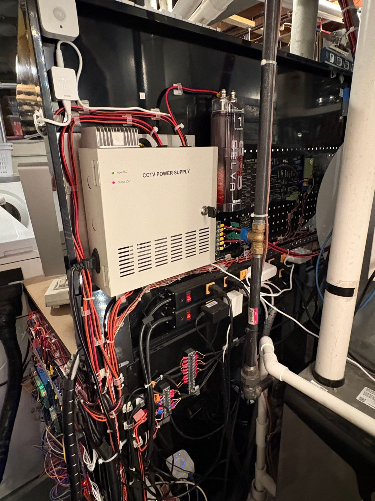

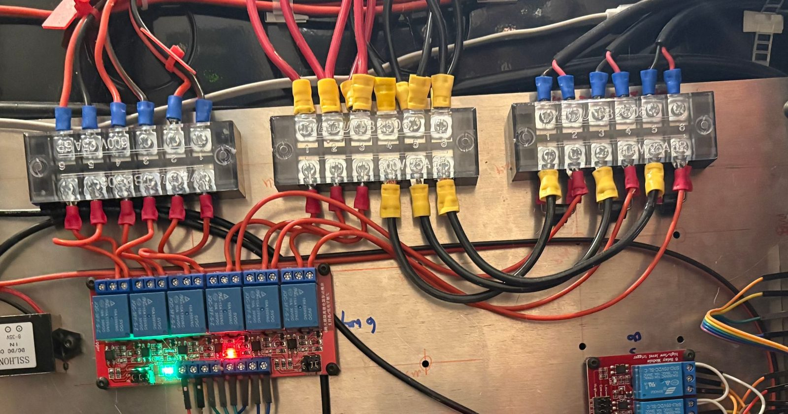

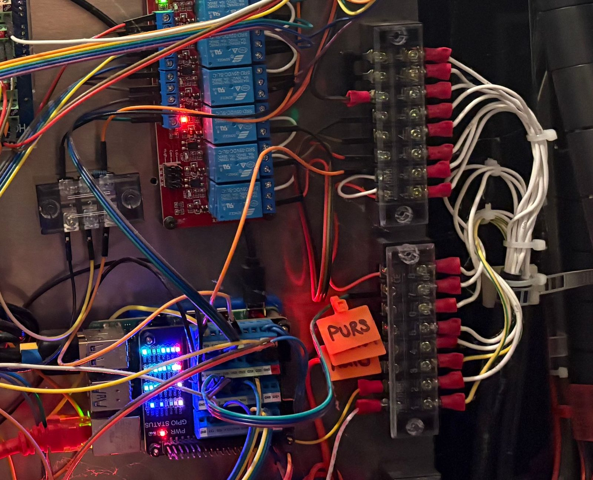

**Distribution strips.** Four 6-way barrier strips (600 V / 25 A) across the
top, numbered left to right:

| Strip | Carries | Wiring |
| --- | --- | --- |
| 1 | **switched, fused 12 V in** — cable `P1` from the D-1384 fuse block | feed lands on terminal 3 (0 V) and 4 (+12 V); 1–2–3 jumpered as 0 V, 4–5–6 jumpered as +12 V. Terminals 1, 2 and 4, 5 are 0 V and +12 V to the two Pi buck converters; 3 and 6 are 0 V and +12 V for the `AUTO`, `NORM` and `PURSUIT` lamps, switched through the bottom three channels of the 8-way relay module |
| 2 | **fused 12 V for the fermenter heaters** | three separately fused +12 V feeds in from the D-1384's `V3`, `V4` and `V5`, each 7.5 A, one per heater; from here to `COM` on relays 1, 2 and 3 of the 6-way module |
| 3 | **24 V bus** | the MGGi 12→24 V converter's output lands on the centre two terminals; 1–2–3 jumpered as +24 V, 4–5–6 as 0 V. +24 V goes into the right three relays of the 6-way module |
| 4 | **24 V to the glycol pumps** | the switched +24 V from those relays, one pair per fermenter |

"Switched" on strip 1 means downstream of the `POWER` button and the two
disconnect relays, so the Pis themselves are on the switched rail — which is
exactly why the disconnects have to hold until both Pis have halted.

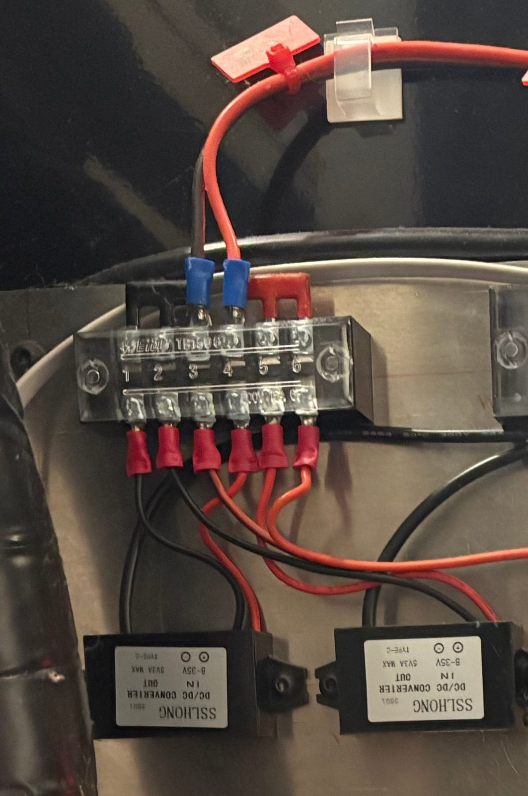

**Two SSLHONG DC/DC converters**, black potted modules below the strips at the
left: 8–35 V in, 5 V 3 A out on a USB-C plug, fed from strip 1. These power the
two Pis.

**A 6-channel relay module** (red board, blue JQC-3FF-S-Z relays, high/low
level trigger) beside the converters, inputs jumpered from the three BrewPi
Arduinos. **Left three relays: heaters** — `COM` fed from strip 2, `NO` out to
a 6-way barrier block on the back of the workbench, under the power capacitor,
where the cables tagged `H1`, `H2` and `H3` leave for the heaters across the
room. **Right three relays: cooling**, switching 24 V from strip 3 onto strip 4
for the glycol pumps. One heater and one pump relay per fermenter,
matching pins 5 and 6 on each Uno.

**A 10-way barrier strip** to the left of the Uno row, where the three fermenter
probes arrive and are jumpered, with 4.7 kΩ pull-ups, to the three BrewPi Unos
(see [Fermenters](#fermenters)).

**Four Arduino Unos on HCDC screw-terminal shields** in a row across the middle.
Three on the left are the BrewPi controllers, each with a probe on `A0` and two
jumpers up to the relay module. The fourth, right of centre, has a rainbow
ribbon into pins 6–10 and is the RaspberryPints pulse counter. **The two switch
pod Unos are at the bottom left** of the panel, so all six Arduinos are here;
each pod reaches the panel by its signal-and-ground cable to one of those two,
plus a 12 V pair from the dash power module for its lamps.

**An 8-channel relay module** (red board, Songle SRD-05VDC-SL-C relays, high/low
level trigger) on the right, driven by a ribbon from one of the Pis, its
contacts wired to the barrier strips beside it. It is **shared between the two
Pis**: the **top five channels connect and disconnect the five SF800 flow
meters**, driven from `brewpi` GPIO 2, 3, 27, 21 and 13, and the **bottom three
switch 12 V from strip 1 to the `AUTO`, `NORM` and `PURSUIT` lamps**, driven
from `rpints` GPIO 19, 20 and 12. The flow meter relays sit **in the pulse
line**: meter → barrier strip → relay contact → Uno pin, so a disconnected
meter still has power and simply cannot be heard.

**Two Raspberry Pi 4s** across the bottom, each wearing a GeeekPi screw-terminal
GPIO breakout HAT with an LED per pin (`PWR` / `GPIO STATUS`), so a lit LED
shows which outputs are high — handy for checking the tables in
[GPIO, rpints](#gpio-rpints) and [GPIO, brewpi](#gpio-brewpi) against the
panel. Ethernet to both, USB out to the Unos.

**Small relay modules** along the bottom. The **4-channel board** under the
`rpints` Pi switches 12 V to the dash boards — speedo, tacho, dummy6, and both
dummy3s on one channel. **Two single-channel boards stacked together** are the
Pi interlocks in the `POWER` button chain, driven from rpints GPIO 23 and brewpi
GPIO 5 and wired through their NC contacts. At the **far bottom right** a 4-way
terminal block carries the power-switching connections, and beside it is the
**HiLetgo bistable latching relay module** that the `POWER` button triggers and
whose output drives the two D-1012 contactors in the supply box. See
[The Power button](#the-power-button). The barrier strip tagged `PURS`, `AUTO`,
`NORM` beside them is the PANP switch strip (see
[PANP switches](#panp-switches)). The Pursuit-only relay is channel 1 of the
4-channel module.

**Right-hand edge**: three 8-way barrier strips, all fed by the same uxcell
8-core cable. The **upper one is the serving keezer**: one cable carries the
five SF800 flow meters *and* the six keezer probes, and the eight cores are
used exactly:

| Position | Carries |
| --- | --- |
| 1 | 0 V for the SF800s and the one-wire probes — the RaspberryPints Uno's `GND`, also tied to the 3-way block and on to the Pi's ground |
| 2 | **+5 V from the RaspberryPints Uno** — the only power in the keezer, feeding the SF800s and the DS18B20s |
| 3 | one-wire data — the six keezer DS18B20s — pulled up to the **Uno's 3.3 V** through a resistor on the small 3-way block below the relay module — the same blue metal-film part as the two on the 12-way strip, so almost certainly 2.2 kΩ **(confirm with a meter)** — then to `rpints` GPIO 4 |
| 4–8 | SF800 pulse lines for taps 1–5, each to a contact on the 8-way relay module and from there to the RaspberryPints Uno |

The 3-way block is the meeting point: keezer ground, Pi ground and the Uno's
3.3 V for the pull-up. Pulling the bus up to 3.3 V rather than the probes' 5 V
supply is what keeps the data line within the Pi's GPIO range, so the probes can
run on 5 V while the Pi reads them directly.

The **lower two carry the PANP cable** — the button contacts and the 12 V lamp
feeds for the four dash pushbuttons, one cable each (see
[PANP switches](#panp-switches)).

## Relay inventory

Every switched load in the system, and who switches it. The relay boards on the
back panel are the common opto-isolated modules; the exact channel each wire
lands on is only recorded on the panel.

| Switched by | Count | Loads |
| --- | --- | --- |
| BrewPi Unos, pin 5 | 3 | fermenter heaters, 12 V — left three relays of the 6-channel module, strip 1 → strip 2 |
| BrewPi Unos, pin 6 | 3 | glycol pumps, 24 V — right three relays of the 6-channel module, strip 3 → strip 4 |
| brewpi GPIO 2/3/27/21/13 | 5 | flow meter pulse lines 1–5 — five channels of the 8-channel module |
| brewpi GPIO 16 | 1 | message centre power — channel 4 of the SunFounder 4-channel module |
| brewpi GPIO 5 | 1 | `POWER` button interlock — NC contact in series with the button, open while brewpi is up |
| rpints GPIO 10, 18 | 2 | dash board power — channels 3 and 2 of the SunFounder 4-channel module |
| rpints GPIO 17 | 1 | Pursuit-only relay (`sp_power`) — channel 1 of the same module |
| rpints GPIO 23 | 1 | `POWER` button interlock — NC contact in series with the button, open while rpints is up |
| `POWER` button, via the latching module | 2 | the two D-1012 30 A contactors — lower: the switched 12 V rail via the fuse block; upper: the buffer capacitor |
| rpints GPIO 19/20/12 | 3 | PANP lamps — bottom three channels of the 8-channel module |
| A419 ×2 | 2 | keezer compressors — self-contained, not on the panel |

## Parts

The bought-in electronics, as they are identified. Where a listing has since
disappeared the ASIN is still the best handle on exactly which variant it was.

| Part | What it is | Source |
| --- | --- | --- |
| 12 V supply | InstallerCCTV 18-channel 12 VDC 30 A CCTV power distribution box, 360 W, UL listed — gutted; only the enclosure and supply module are in use | [Amazon B08XMKT1F8](https://www.amazon.com/dp/B08XMKT1F8), listing gone |
| Main contactors ×2 | CZH-Labs MD-D1012T/12V, DIN-rail SPST-NO 30 A power relay module (TE T9AS1D12-12 relay), 12 V coil — driven by the latching module, switch the 12 V rail | [Amazon B00UA46BFE](https://www.amazon.com/dp/B00UA46BFE), [czh-labs.com](https://czh-labs.com/products/czh-labs-din-rail-mount-coil-12v-passive-1-channel-spst-no-30a-30amp-power-relay-module) |
| Power latch | HiLetgo 12 V single bistable self-locking relay module, push-to-toggle with external trigger input, 10 A contact; output taken from `NC` | [Amazon B01HHM5M4M](https://www.amazon.com/dp/B01HHM5M4M) |
| Power interlocks ×2 | DC 5 V 1-channel opto-isolated relay module, high/low trigger by jumper, `COM`/`NC` used, powered from each Pi's 5 V, `IN` from IO23 (rpints) and IO5 (brewpi) | [Amazon B079FJSYGY](https://www.amazon.com/dp/B079FJSYGY) |
| Fused distribution | CZH-Labs D-1384, 6-position DIN-rail DC fuse distribution module, ATO/ATC blade fuses, 30 A in, up to 10 A per output, blown-fuse LED per channel | [Amazon B08PT3PXSB](https://www.amazon.com/dp/B08PT3PXSB), [czh-labs.com](https://czh-labs.com/products/din-rail-mount-6-position-dc-power-fuse-distribution-strip-module) |
| 24 V converter | MGGi DC 12 V→24 V boost converter, 15 A, 360 W, IP68 potted aluminium case; mounted on top of the supply box | [Amazon B09TB35ZGD](https://www.amazon.com/dp/B09TB35ZGD) |
| Workbench | Kobalt 45 in W × 36 in H three-drawer hardwood workbench with pegboard back — the dash is cut into the pegboard, the electronics hang behind it | [Lowe's 1002624252](https://www.lowes.com/pd/Kobalt-45-in-W-x-36-in-H-3-Drawer-Hardwood-Work-Bench/1002624252) |
| PANP switches ×4 | Honeywell MICRO SWITCH illuminated pushbutton, marked 4A13BAA31, 5 A 250 VAC contacts, 28 V lamp — supplied with the dash by ideegeniali | — |
| Level shifters ×2 | TXS0108E 8-channel bidirectional logic level converter module, 3.3 V side to the Pi, 5 V side to the dash serial lines, `OE` from GPIO 25; one per Pi | [Amazon B09XH4PV5J](https://www.amazon.com/dp/B09XH4PV5J) |
| Field cable ×3 | uxcell RVV 8-core 20 AWG stranded PVC cable, 300 V, 3 m — PANP contacts, PANP lamps, and the SF800 flow meters | [Amazon B07RHV4WNV](https://www.amazon.com/dp/B07RHV4WNV) |
| Pi power ×2 | SSLHONG DC 12/24 V to 5 V 3 A 15 W USB-C step-down buck module, 8–35 V in, epoxy potted | [Amazon B07ZQB6S3L](https://www.amazon.com/dp/B07ZQB6S3L) |
| Fermenter relays | ANMBEST 6-channel 5 V opto-isolated relay module, 10 A contacts, high/low level trigger by jumper | [Amazon B08RRTHTYQ](https://www.amazon.com/dp/B08RRTHTYQ) |
| Flow meter and PANP lamp relays | HiLetgo 5 V 8-channel opto-isolated relay module, Songle SRD-05VDC-SL-C relays, high/low level trigger | [Amazon B00LX3UH9C](https://www.amazon.com/dp/B00LX3UH9C) |
| Dash power relays | SunFounder 5 V 4-channel relay module — speedo, tacho, dummy6, both dummy3s | [Amazon B00E0NSORY](https://www.amazon.com/dp/B00E0NSORY) |
| Fermenter heaters ×2 | SS Brewtech legacy FTSs heater pad, 60 W, 12 V, barrel jack — chronical and unitank-2 | [ssbrewtech.com](https://www.ssbrewtech.com/products/heater-pad-60w-for-chronical) |
| Fermenter heater ×1 | SS Brewtech FTSs Touch heating pad, 12 V, XT30 connector, SKU HTR180WXT — unitank-1 | [ssbrewtech.com](https://www.ssbrewtech.com/products/ftss-touch-chronical-and-unitank-heating-pad) |
| Buffer capacitor | Belva BB1D 1 farad car-audio power capacitor with voltmeter display, across the 12→24 V converter's 12 V input via the upper D-1012 and an inline fuse | — |
| Glycol pumps ×4 | Penguin Chillers XL glycol pump, 24 VDC, 55 W, 6 GPM max, 50 ft head, 3/8" or 1/2" fittings — three on BrewPi relays from the 24 V bus, one always on for the draft trunk line from its own Penguin mains adapter | [penguinchillers.com](https://penguinchillers.com/products/glycol-pumps) |
| Glycol chillers ×2 | SS Brewtech 1/5 hp glycol chiller, 1450 BTU/h, 4.75 gal reservoir, 120 VAC — set to 23 °F (unitanks) and 26 °F (chronical and trunk line) | [ssbrewtech.com](https://www.ssbrewtech.com/products/glycol-chiller-1-5hp) |
| Temperature probes | HiLetgo DS18B20, stainless steel waterproof probe on 1 m lead — red VCC, yellow data, black GND | [Amazon B00M1PM55K](https://www.amazon.com/dp/B00M1PM55K) |
| Arduino shields ×6 | HCDC screw terminal block breakout shield for Arduino Uno R3 — 3.5 mm terminals, 26–16 AWG, IDC40 header, power LED, reset button, ICSP pass-through | [Amazon B08LH5TCM5](https://www.amazon.com/dp/B08LH5TCM5) |
| Pi GPIO breakouts ×2 | GeeekPi GPIO screw terminal block breakout HAT with per-pin status LEDs — 3.5 mm terminals, 26–16 AWG; LED matrix mirrors the 2×20 header, light blue for GPIO, dark blue for special-function pins, red 5 V, pink 3.3 V | [Amazon B08GKQMC72](https://www.amazon.com/dp/B08GKQMC72) |
| Barrier strips | dual-row covered screw barrier strips, a mixture of: 6-way 600 V 25 A ([B07CLY5N9T](https://www.amazon.com/dp/B07CLY5N9T), [mxuteuk TB-2506 B0869D8B5Z](https://www.amazon.com/dp/B0869D8B5Z)); 8-way 600 V 15 A ([uxcell TB-1508L B07DM2T59R](https://www.amazon.com/dp/B07DM2T59R)); 4-way 600 V 25 A ([mxuteuk TB-2504 B0869CYWSC](https://www.amazon.com/dp/B0869CYWSC)) and 15 A ([mxuteuk TB-1504 B0869CYC2K](https://www.amazon.com/dp/B0869CYC2K)); 12-way 600 V 15 A ([B07CLW5FPS](https://www.amazon.com/dp/B07CLW5FPS)) | see left |

## Still to confirm

Everything above has been walked with the owner. What is left is small, and
each item is also marked **(confirm)** where it comes up:

1. **Panel one-wire buses** — that the lager and hot-side probes really are in
   parasite-power mode (`VDD` to ground at the probe), and a meter reading of
   the 2.2 kΩ pull-ups.
2. **The keezer pull-up** — a meter reading of the resistor on the 3-way block;
   it looks like the same 2.2 kΩ part as the other two.
3. **rpints shifter channels** — which of `A6`/`B6` and `A7`/`B7` carries the
   tacho and which the dummy bus.
