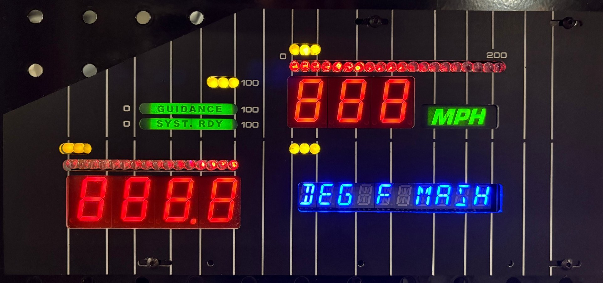
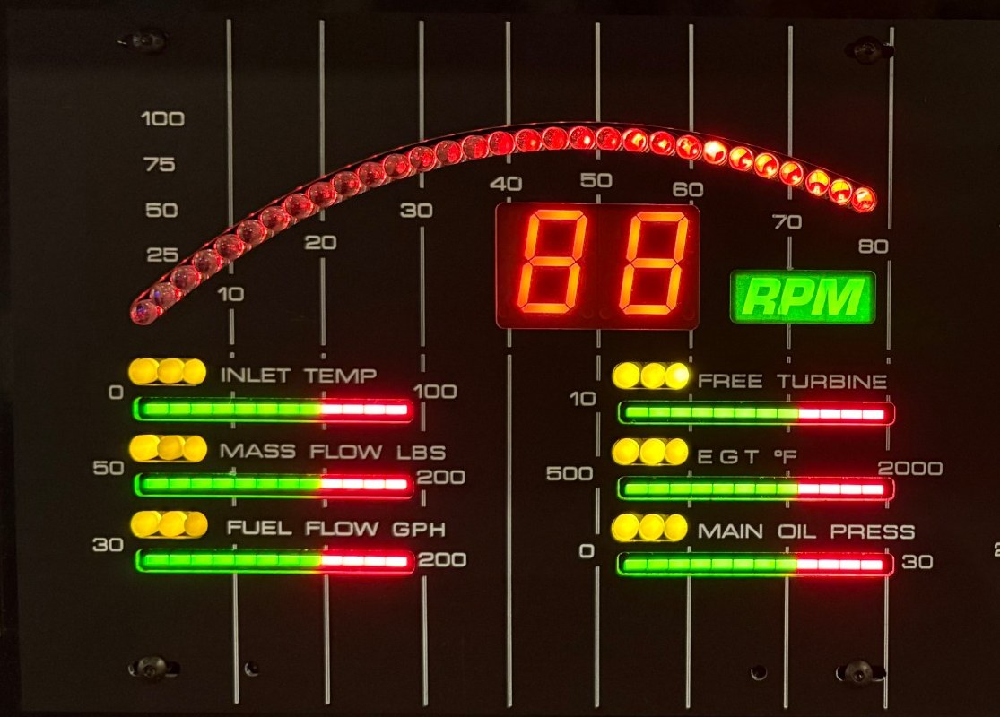
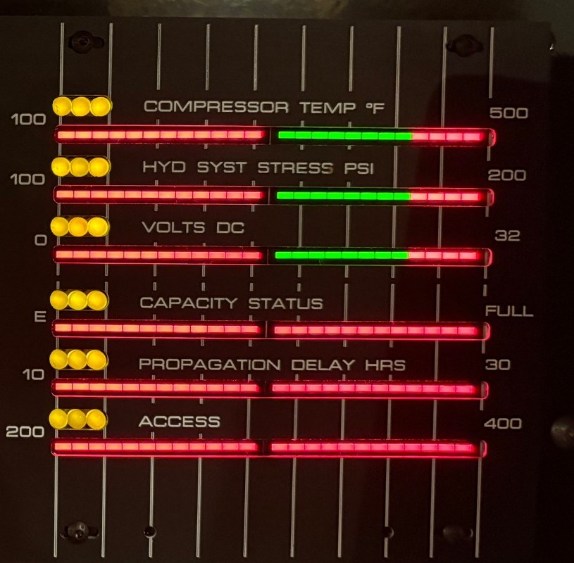
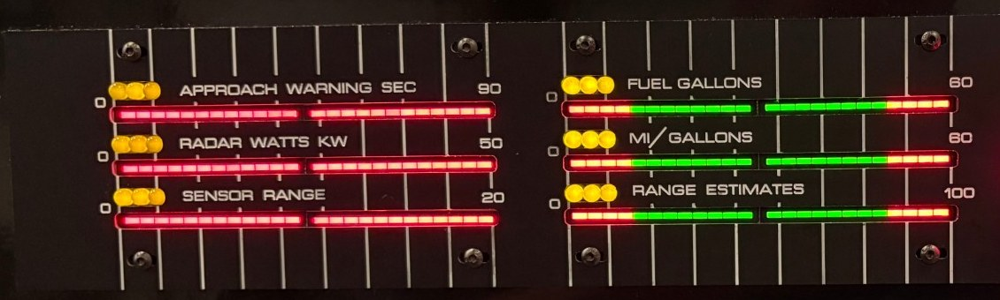
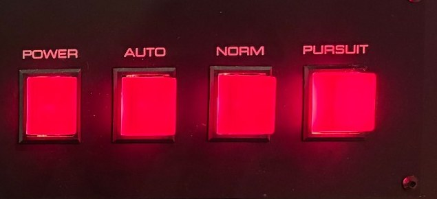
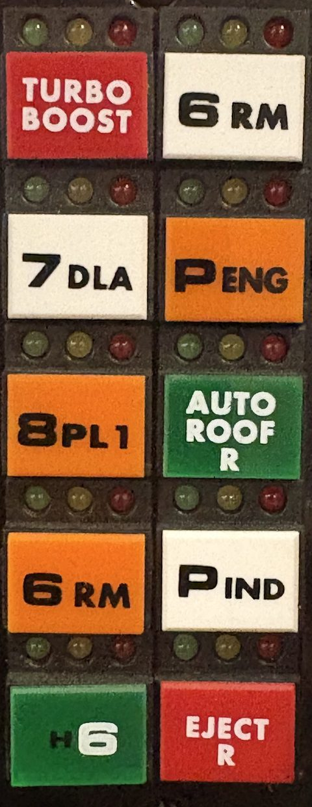
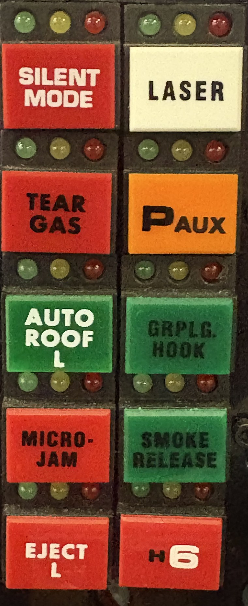

# What the dashboard is actually telling you

The dash carries KITT's original season 2 labels — inlet temperature, hydraulic
system stress, propagation delay. None of them mean what they say. This is the
decoder ring.

Each section below shows the panel as KITT has it — the labels are set in
Eurostyle Extended, the typeface the show used — beside what the brewery
actually puts behind them. The photographs are of this dash, taken in
September 2026 with `panp.py` stopped and every bar, LED and segment driven
full from a script, at Norm brightness so the camera did not saturate. They
are a truthful reference for LED counts and colours.

[`images/s2-dash.png`](../images/s2-dash.png) is a high-resolution scan of
the season 2 panel artwork this hardware reproduces. It is useful for the
labels, but it is artwork rather than a photograph and has at least one error:
it draws **15** LEDs on the line above the multifunction display where the
real board has **16**. Don't count LEDs off the scan; count them off the
photographs or the hardware.

Letters in parentheses are the board's serial address — see
[README.md](README.md) for the protocol and [`panp/panp.py`](panp/panp.py) for
the code.

## Speedo cluster (B)



| KITT label | Brewery value |
| --- | --- |
| `MPH`, 3 digits | **HLT temperature**, °F, rounded to whole degrees |
| bargraph above `MPH` | the same HLT temperature — 20 LEDs on 19 addressable steps of 10 °F, one step lighting two LEDs, so 160 °F lights 17 and the line is full at 190 °F |
| `000.0`, 4 digits | **the selected value** — whatever the left switch pod last chose |
| 16-LED bargraph above it | the same selected value, scaled to its own range — 16 LEDs on 13 addressable steps, three steps lighting two LEDs; each mode's span runs from dark to full over those 13 steps |
| `GUIDANCE`, `SYST. RDY` | unused |
| alphanumeric row | the message center — see below |

The lower display is the multi-function one. What it shows, and the scale the
bargraph uses, both depend on the left switch pod:

| Showing | Bargraph spans | Decimal |
| --- | --- | --- |
| mash tun temperature | dark at 110 °F, full at 190 °F | `000.0` |
| HLT temperature | dark at 110 °F, full at 190 °F | `000.0` |
| unitank 1, unitank 2 or chronical temperature | dark at 34 °F, full at 82 °F | `000.0` |
| any of those three gravities | dark at 1.000, full at 1.064 | `0.000` |

## How the bargraphs work

This applies to the tacho and the three dummy boards. The speedo is different —
its two LED lines take a direct count of LEDs to light.

**None of these bars are addressable LED by LED.** For each one the Pi sends a
single byte, and the board turns that into a *fill level*: it lights that many
segments from the left and leaves the rest dark. There is no way to light an
arbitrary pattern, and no way to ask for a colour.

The resolutions differ, and the threshold tables in `panp.py` exist to match
them — each list is a set of byte values picked so consecutive entries land on
consecutive fill steps:

| Bars | Segments | Steps | Table in `panp.py` |
| --- | --- | --- | --- |
| tacho probe bars | 12 | 8 | `tacho_bar` — 8 values, landing on steps 1–8 |
| tacho RPM arc | 30 LEDs | 30 | `rpm_circle` — returns the step number itself |
| fermenter bars (`F`) | 24 | 16 | `temperature_bar` — 16 values, steps 1–16 |
| lager and keg bars (`E`, `G`) | 24 | 16 | `lager_bar`, `keg_bar` — 17 values, steps 0–16 |

**The building block is a 12-segment bar-graph part.** Each tacho bar is one of
them, driven with 8 steps. Each dummy row is **two** of them side by side, 24
segments, driven with 16 steps. So on every bar there are three segments for
every two steps: one step moves the bar by a segment and a half on average, and
the visible resolution is coarser than the bar looks. Only the RPM arc is one
LED per step, which is why its value is a raw index.

The speedo's two LED lines are round LEDs rather than bar-graph parts: **20**
above `MPH` and **16** above the multifunction display. The `MPH` line is 19
addressable steps, one of which lights two LEDs; the multifunction line is 13
steps, three of which light two LEDs. That was measured on the board in
September 2026 by sending step counts with `panp.py` stopped: 16 and 8 lit 17
and 10, and 19 and 13 filled both lines exactly. The Pi sends each line a step
count: one step per 10 °F of HLT temperature on the `MPH` line, and for the
multifunction line each mode's span in `LOWER_DISPLAY` stretched over the 13
steps, so every scale ends at exactly full. Note that the physical LED count
and the addressable count are different numbers on this dash; the private repo
records which is which for every board.

Two consequences worth holding on to.

**The red/green split is physical.** The coloured segments are fixed in the bar
hardware. The host only ever says *light this many*; whether that lands in green
or in red is decided entirely by where the numbers in those threshold lists
fall. "Green means the keezer is at serving temperature" is a property of the
list, not something the software colours in. Retuning the dash means moving
those thresholds so the colour changes at the temperature you care about.

There are only two kinds of 12-segment part — all red, or 8 green then 4 red —
and the layouts come from how they are placed, counted on the hardware:

| Bars | Layout, left to right | Reads as |
| --- | --- | --- |
| tacho probe ×6 | `ggggggggrrrr` | too warm at the top end only |
| dummy6 top 3, lager temps | `rrrrrrrrrrrr ggggggggrrrr` | too cold, ideal, too warm |
| dummy3 `F` ×3, fermenter temps | `rrrrgggggggg ggggggggrrrr` | too cold, ideal, too warm |
| dummy6 bottom 3, keg volumes | `rrrrrrrrrrrr rrrrrrrrrrrr` | just more or less |
| dummy3 `E` ×3, keg volumes | `rrrrrrrrrrrr rrrrrrrrrrrr` | just more or less |

On `F` the left-hand part is the same green/red part as the right-hand one,
mounted upside down, which is how the row comes to be red at both ends with
sixteen green in the middle. On dummy6 the left-hand part is an all-red one, so
the green band sits in the right half only. The green and red are separate
LEDs, not a bicolour part.

**None of that was chosen for the brewery.** The colour layout is KITT's — the
boards reproduce the season 2 dash, so which bars are red and which are
red/green was fixed by the show long before any of this. Both dummy3 variants
exist because the car has one of each.

The design went the other way round: the brewery was mapped onto the dash it
found. The counts happen to line up almost exactly —

| The dash has | The brewery has |
| --- | --- |
| 6 tacho bars | 6 serving keezer probes |
| 3 red/green bars on dummy6 | 3 kegs in the lagering keezer |
| 3 red/green bars on dummy3 `F` | 3 fermenters |
| 6 all-red bars across dummy6 and `E` | 5 serving kegs, plus a total |

— and the assignment was then chosen so the things with a good and a bad range
landed on the bars that show colour, and the volumes landed on the ones that
don't. The keezer probes on the tacho get red at the warm end only, which suits
them, but that is the tacho's layout being convenient rather than anything
anyone picked.

**The RPM circle is the exception.** Every other bar takes a scaled byte; the
circle takes its step number directly, which is why `rpm_circle` returns a plain
index 0–30 while its sibling functions return hex levels. Don't "tidy" it to
match the others.

Note also that `tacho_bar` starts at step 1, not 0 — those six bars never go
fully dark, while an empty keg on `keg_bar` does. And the tacho animates where
the dummy bars do not: a tacho bar or the RPM arc jumps straight up to a higher
value but falls to a lower one a step at a time, while the dummy bars jump in
both directions. That is the boards behaving differently, not the Pi.

## Tacho cluster (A)



| KITT label | Brewery value |
| --- | --- |
| `RPM`, 2 digits | **the selected keezer or lager temperature**, °F — anything over 99 shows `HI` |
| the RPM arc | the same value again, as a sweep from 2 °F to 80 °F |
| `INLET TEMP` | keezer probe 1 |
| `MASS FLOW LBS` | keezer probe 2 |
| `FUEL FLOW GPH` | keezer probe 3 |
| `FREE TURBINE` | keezer probe 4 |
| `E.G.T. °F` | keezer probe 5 |
| `MAIN OIL PRESS` | keezer probe 6 |

The six bargraphs always show all six keezer probes, whatever the digits are
set to. Each spans 30 °F to 51 °F across its 8 steps, so solidly green is a
keezer at serving temperature and red at the top end is too warm. Because the
fan is off you can watch the keezer stratify across the six.

The probe-to-bar correspondence is positional — `panp.py` sends the six probes
in the order they appear in `KEEZER_PROBES`, and the board lights bars 1–6 in
its own fixed order. The table above assumes that order runs down the left
column and then down the right. If a probe ever shows up on the wrong bar,
reorder `KEEZER_PROBES` rather than the serial message.

## Dummy6 (G)



| KITT label | Brewery value |
| --- | --- |
| `COMPRESSOR TEMP °F` | lager keg 1 temperature |
| `HYD SYST STRESS PSI` | lager keg 2 temperature |
| `VOLTS DC` | lager keg 3 temperature |
| `CAPACITY STATUS` | **total beer on tap** — the average of the five kegs' remaining percentages, so `E` is every keg dry and `FULL` is every keg full. It is not volume-weighted: the 2.5 gal cask counts the same as a 5 gal keg |
| `PROPAGATION DELAY HRS` | keg 1 remaining |
| `ACCESS` | keg 2 remaining |

The top three are the red/green rows, which suits a lagering temperature:
`lager_bar` runs from dark below 23.5 °F to full at 35.5 °F in roughly
half-degree steps. The left twelve segments are red, so the bar is red until
about step 8, roughly 30 °F, then climbs through the eight green segments and
into the four red ones at the top. The bottom three are all red, which suits a
volume.

`CAPACITY STATUS` keeping its own name is the one honest label on the dash.

## Dummy3 left, all red (E)

The two dummy3 boards sit side by side — all-red `E` on the left, red/green `F`
on the right.



| KITT label | Brewery value |
| --- | --- |
| `APPROACH WARNING SEC` | keg 3 remaining |
| `RADAR WATTS KW` | keg 4 remaining |
| `SENSOR RANGE` | keg 5 remaining |

Volumes come from the RaspberryPints database as a percentage of each keg's
starting volume, refreshed every tenth pass of the loop.

## Dummy3 right, red/green (F)

| KITT label | Brewery value |
| --- | --- |
| `FUEL GALLONS` | unitank 1 temperature |
| `MI / GALLONS` | unitank 2 temperature |
| `RANGE ESTIMATES` | chronical temperature |

Each row spans 30 °F to 76 °F across `temperature_bar`'s 16 steps, with four
red segments at each end and sixteen green between, so the green band runs from
roughly 34 °F to 70 °F. A fermenter holding its setpoint sits in the green while
a crash or a runaway shows as red at one end or the other.

The 70 °F top of the green is deliberate, not a rounding: none of the recipes
brewed here ferment above it, so anything warmer really is a fault. Don't widen
that band to match a general-purpose ale range. The exact step at which each
colour boundary lights depends on how the board's 16 steps are shared out over
24 segments, so check on the bench before moving a threshold by one entry.

## Message center (C)

In **Norm** and **Pursuit** it captions the lower speedo display: `DEG F MASH`,
`SG UTK1`, and so on, so you know what the `000.0` refers to. Pressing a flow
meter button interrupts it with `FLOW n on` for a second.

In **Auto** the rest of the dash is powered down and the message center stays
lit on its own, showing `BREWPI UP` and, if any flow meters are running, which
ones.

## PANP



| Button | Effect |
| --- | --- |
| `POWER` | not software — toggles a latching relay on the whole 12 V supply, but each Pi holds an interlock open while it is up, so the button does nothing until both Pis have halted |
| `AUTO` | dash off, message center still lit |
| `NORM` | dash on, dimmed |
| `PURSUIT` | dash on, full brightness — the switch pod lamps and the bench light come on too |

Pressing one of these on the rpints Pi also signals the brewpi Pi over GPIO, so
both halves of the dash change together.

Pursuit also switches the Hue light strip over the workbench to full brightness
and a neutral white, so there is enough light to read small print on things;
Norm and Auto switch it off again, as does halting the Pis. It is driven
straight from the bridge's own API rather than through HomeKit, but the bridge
is what Home talks to, so Home follows along.

This is optional. `panp.py` reads the bridge address, key and light id from
`/usr/local/etc/panp-hue.json`, which is not in this repository because that key
grants full control of everything on the bridge. With no config file nothing
happens at all, which is the case on `brewpi`. `systemctl status panp` says
which of the two it found. See
[panp/panp-hue.json.example](panp/panp-hue.json.example) for the shape and
[panp/README.md](panp/README.md) to set one up.

## Switch pods

Swapping the button legends is a Knight Rider tradition, so these differ from
the panel scan. The pods are wired as a resistive ladder read by an Arduino,
which reports a position 0–9; even positions are the left column top to bottom,
odd positions the right column. See [switchpod/README.md](switchpod/README.md).

### Right pod — picks what the tacho shows



| Button | Pos | Shows on `RPM` and the arc |
| --- | --- | --- |
| `TURBO BOOST` | 0 | keezer probe 1 |
| `7 DLA` | 2 | keezer probe 2 |
| `8 PL1` | 4 | keezer probe 3 |
| `6 RM` (orange) | 6 | keezer probe 4 |
| `H6` | 8 | keezer probe 5 |
| `6 RM` (white) | 1 | keezer probe 6 |
| `P ENG` | 3 | lager keg 1 |
| `AUTO ROOF R` | 5 | lager keg 2 |
| `P IND` | 7 | lager keg 3 |
| `EJECT R` | 9 | mean of the six keezer probes |

There are two `6 RM` buttons; the white one at the top of the right column is
probe 6, the orange one in the left column is probe 4.

### Left pod — picks what the speedo and message center show



| Button | Pos | Action |
| --- | --- | --- |
| `SILENT MODE` | 0 | mash tun temperature |
| `TEAR GAS` | 2 | HLT temperature |
| `AUTO ROOF L` | 4 | unitank 1 — press again to swap temperature and gravity |
| `MICRO-JAM` | 6 | unitank 2 — likewise |
| `EJECT L` | 8 | chronical — likewise |
| `LASER` | 1 | toggle flow meter 1 |
| `PAUX` | 3 | toggle flow meter 2 |
| `GRPLG. HOOK` | 5 | toggle flow meter 3 |
| `SMOKE RELEASE` | 7 | toggle flow meter 4 |
| `H6` | 9 | toggle flow meter 5 |

The left column selects a display; the right column switches relays. Both pods
have an `H6`, on opposite sides and in different colours.

## Provenance

Everything above describes what `panp.py` actually sends, read off the code and
checked against the panel scan.

An abandoned ESP32 rebuild of the dash electronics once lived in `karr/`,
including mockups that relabelled these gauges *differently* — `MPH` as unitank
temperature, the tacho bars as kegs 1–5 plus the line. It was never built, and
it has been removed to stop those sketches being mistaken for this. It is
recoverable if ever needed:

```bash
git checkout karr-prototype -- karr/
```
