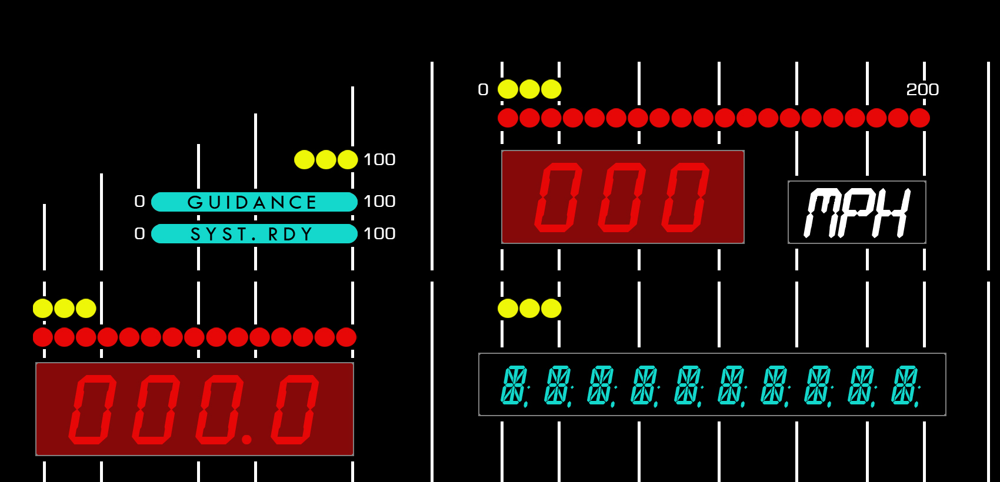
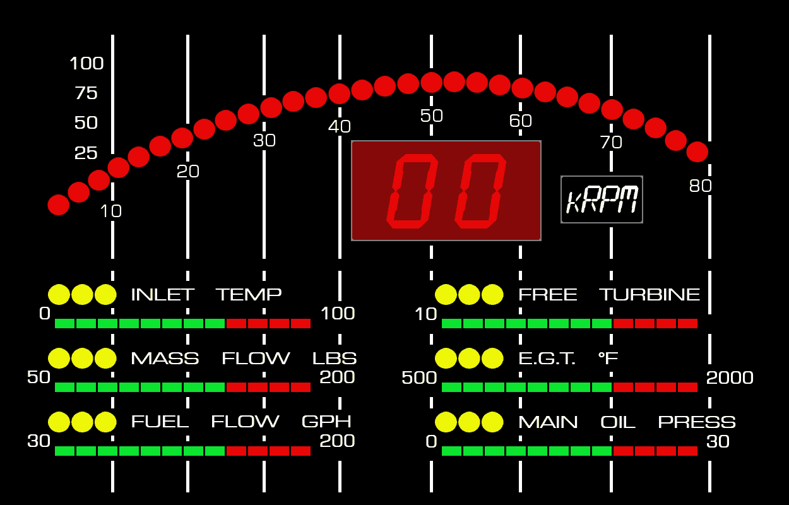
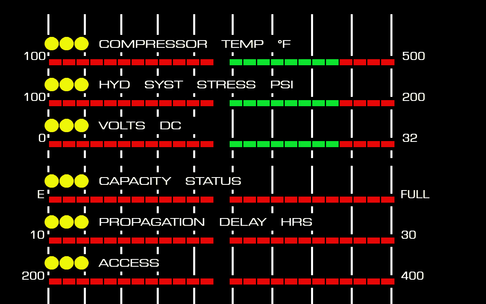
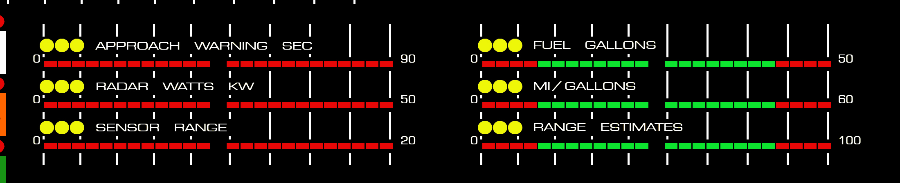

# What the dashboard is actually telling you

The dash carries KITT's original season 2 labels — inlet temperature, hydraulic
system stress, propagation delay. None of them mean what they say. This is the
decoder ring.

Each section below shows the panel as KITT has it — the labels are set in
Eurostyle Extended, the typeface the show used — beside what the brewery
actually puts behind them. The crops come from
[`images/s2-dash.png`](../images/s2-dash.png), a high-resolution scan of the
season 2 panel this hardware reproduces.

That scan is artwork, not a photograph, and it has at least one error: it draws
**15** LEDs on the line above the multifunction display where the real board has
**16**. Every other count in it checks out against the hardware. Don't count
LEDs off the scan without checking them.

Letters in parentheses are the board's serial address — see
[README.md](README.md) for the protocol and [`panp/panp.py`](panp/panp.py) for
the code.

## Speedo cluster (B)



| KITT label | Brewery value |
| --- | --- |
| `MPH`, 3 digits | **HLT temperature**, °F, rounded to whole degrees |
| bargraph above `MPH` | the same HLT temperature — 20 LEDs, one per 10 °F |
| `000.0`, 4 digits | **the selected value** — whatever the left switch pod last chose |
| 16-LED bargraph above it | the same selected value, scaled to its own range |
| `GUIDANCE`, `SYST. RDY` | unused |
| alphanumeric row | the message center — see below |

The lower display is the multi-function one. What it shows, and the scale the
bargraph uses, both depend on the left switch pod:

| Showing | Bargraph spans | Decimal |
| --- | --- | --- |
| mash tun temperature | 110 °F upward, 5 °F per LED | `000.0` |
| HLT temperature | 110 °F upward, 5 °F per LED | `000.0` |
| unitank 1, unitank 2 or chronical temperature | 34 °F upward, 3 °F per LED | `000.0` |
| any of those three gravities | 1.000 upward, 0.004 per LED | `0.000` |

## How the bargraphs work

This applies to the tacho and the three dummy boards. The speedo is different —
its two LED lines take a direct count of LEDs to light.

**None of these bars are addressable LED by LED.** For each one the Pi sends a
single byte, and the board turns that into a *fill level*: it lights that many
segments from the left and leaves the rest dark. There is no way to light an
arbitrary pattern, and no way to ask for a colour.

The resolutions differ, and the threshold tables in `panp.py` exist to match
them — each list is a set of byte values picked so consecutive entries land on
consecutive fill steps:

| Bars | LEDs | Steps | Table in `panp.py` |
| --- | --- | --- | --- |
| tacho probe bars | 12 | 8 | `tacho_bar` — 8 values, landing on steps 1–8 |
| tacho RPM arc | 30 | 30 | `rpm_circle` — returns the step number itself |
| fermenter bars (`F`) | 24 | 16 | `temperature_bar` — 16 values, steps 1–16 |
| lager and keg bars (`E`, `G`) | 24 | 16 | `lager_bar`, `keg_bar` — 17 values, steps 0–16 |

**The bars have more segments than steps** — 12 against 8, and 24 against 16,
exactly three to two in both cases. So one step moves the bar by a segment and a
half on average, and the visible resolution is coarser than the bar looks. Only
the RPM arc is one LED per step, which is why its value is a raw index.

For completeness, the speedo's two LED lines are one LED per count: **20** above
`MPH` and **16** above the multifunction display. All these counts were checked
against the hardware.

Two consequences worth holding on to.

**The red/green split is physical.** The coloured segments are fixed in the bar
hardware, so many green and then red. The host only ever says *light this many*;
whether that lands in green or in red is decided entirely by where the numbers
in those threshold lists fall. "Green means the keezer is at serving
temperature" is a property of the list, not something the software colours in.
Retuning the dash means moving those thresholds so the colour change happens at
the temperature you care about.

**The RPM circle is the exception.** Every other bar takes a scaled byte; the
circle takes its step number directly, which is why `rpm_circle` returns a plain
index 0–30 while its sibling functions return hex levels. Don't "tidy" it to
match the others.

Note also that `tacho_bar` starts at step 1, not 0 — those six bars never go
fully dark, while an empty keg on `keg_bar` does. And the tacho sweeps to a new
value a step at a time where the dummy bars jump straight to it; that is the
boards behaving differently, not the Pi.

## Tacho cluster (A)



| KITT label | Brewery value |
| --- | --- |
| `kRPM`, 2 digits | **the selected keezer or lager temperature**, °F — anything over 99 shows `HI` |
| the RPM arc | the same value again, as a sweep from 2 °F to 80 °F |
| `INLET TEMP` | keezer probe 1 |
| `MASS FLOW LBS` | keezer probe 2 |
| `FUEL FLOW GPH` | keezer probe 3 |
| `FREE TURBINE` | keezer probe 4 |
| `E.G.T. °F` | keezer probe 5 |
| `MAIN OIL PRESS` | keezer probe 6 |

The six bargraphs always show all six keezer probes, whatever the digits are
set to. Each spans 30 °F to 51 °F across its 8 steps, so solidly green is a
keezer at serving temperature and red at the top end is too warm. Because the
fan is off you can watch the keezer stratify across the six.

The probe-to-bar correspondence is positional — `panp.py` sends the six probes
in the order they appear in `keezer_probes`, and the board lights bars 1–6 in
its own fixed order. The table above assumes that order runs down the left
column and then down the right. If a probe ever shows up on the wrong bar,
reorder `keezer_probes` rather than the serial message.

## Dummy6 (G)



| KITT label | Brewery value |
| --- | --- |
| `COMPRESSOR TEMP °F` | lager keg 1 temperature |
| `HYD SYST STRESS PSI` | lager keg 2 temperature |
| `VOLTS DC` | lager keg 3 temperature |
| `CAPACITY STATUS` | **total beer on tap** — `E` is dry, `FULL` is four 5 gal kegs plus the 2.5 gal cask |
| `PROPAGATION DELAY HRS` | keg 1 remaining |
| `ACCESS` | keg 2 remaining |

The top three are the red/green bars, which suits a lagering temperature: one
green segment is 30 °F, half-degree steps up from there. The bottom three are
all red, which suits a volume.

`CAPACITY STATUS` keeping its own name is the one honest label on the dash.

## Dummy3 left, all red (E)

The two dummy3 boards sit side by side — all-red `E` on the left, red/green `F`
on the right.



| KITT label | Brewery value |
| --- | --- |
| `APPROACH WARNING SEC` | keg 3 remaining |
| `RADAR WATTS KW` | keg 4 remaining |
| `SENSOR RANGE` | keg 5 remaining |

Volumes come from the RaspberryPints database as a percentage of each keg's
starting volume, refreshed every tenth pass of the loop.

## Dummy3 right, red/green (F)

| KITT label | Brewery value |
| --- | --- |
| `FUEL GALLONS` | unitank 1 temperature |
| `MI / GALLONS` | unitank 2 temperature |
| `RANGE ESTIMATES` | chronical temperature |

Each bar spans 30 °F to 76 °F, so a fermenter holding its setpoint sits in the
green and a crash or a runaway shows as red.

## Message center (C)

In **Norm** and **Pursuit** it captions the lower speedo display: `DEG F MASH`,
`SG UTK1`, and so on, so you know what the `000.0` refers to. Pressing a flow
meter button interrupts it with `FLOW n on` for a second.

In **Auto** the rest of the dash is powered down and the message center stays
lit on its own, showing `BREWPI UP` and, if any flow meters are running, which
ones.

## PANP

| Button | Effect |
| --- | --- |
| `POWER` | not software — a relay held closed while both Pis are up, so the dash cannot be cut without halting them first |
| `AUTO` | dash off, message center still lit |
| `NORM` | dash on, dimmed |
| `PURSUIT` | dash on, full brightness — and the bench light comes on |

Pressing one of these on the rpints Pi also signals the brewpi Pi over GPIO, so
both halves of the dash change together.

Pursuit also switches the Hue bench light over the workbench to full brightness
and a neutral white, so there is enough light to read small print on things;
Norm and Auto switch it off again, as does halting the Pis. It is driven
straight from the bridge's own API rather than through HomeKit, but the bridge
is what Home talks to, so Home follows along.

This is optional. `panp.py` reads the bridge address, key and light id from
`/usr/local/etc/panp-hue.json`, which is not in this repository because that key
grants full control of everything on the bridge. With no config file nothing
happens at all, which is the case on `brewpi`. `systemctl status panp` says
which of the two it found. See
[panp/panp-hue.json.example](panp/panp-hue.json.example) for the shape and
[panp/README.md](panp/README.md) to set one up.

## Switch pods

Swapping the button legends is a Knight Rider tradition, so these differ from
the panel scan. The pods are wired as a resistive ladder read by an Arduino,
which reports a position 0–9; even positions are the left column top to bottom,
odd positions the right column. See [switchpod/README.md](switchpod/README.md).

### Right pod — picks what the tacho shows


| Button | Pos | Shows on `kRPM` and the arc |
| --- | --- | --- |
| `TURBO BOOST` | 0 | keezer probe 1 |
| `7 DLA` | 2 | keezer probe 2 |
| `8 PL1` | 4 | keezer probe 3 |
| `6 RM` (orange) | 6 | keezer probe 4 |
| `H6` | 8 | keezer probe 5 |
| `6 RM` (white) | 1 | keezer probe 6 |
| `P ENG` | 3 | lager keg 1 |
| `AUTO ROOF R` | 5 | lager keg 2 |
| `P IND` | 7 | lager keg 3 |
| `EJECT R` | 9 | mean of the six keezer probes |

There are two `6 RM` buttons; the white one at the top of the right column is
probe 6, the orange one in the left column is probe 4.

### Left pod — picks what the speedo and message center show


| Button | Pos | Action |
| --- | --- | --- |
| `SILENT MODE` | 0 | mash tun temperature |
| `TEAR GAS` | 2 | HLT temperature |
| `AUTO ROOF L` | 4 | unitank 1 — press again to swap temperature and gravity |
| `MICRO-JAM` | 6 | unitank 2 — likewise |
| `EJECT L` | 8 | chronical — likewise |
| `LASER` | 1 | toggle flow meter 1 |
| `PAUX` | 3 | toggle flow meter 2 |
| `GRPLG. HOOK` | 5 | toggle flow meter 3 |
| `SMOKE RELEASE` | 7 | toggle flow meter 4 |
| `H6` | 9 | toggle flow meter 5 |

The left column selects a display; the right column switches relays. Both pods
have an `H6`, on opposite sides and in different colours.

## Provenance

Everything above describes what `panp.py` actually sends, read off the code and
checked against the panel scan.

An abandoned ESP32 rebuild of the dash electronics once lived in `karr/`,
including mockups that relabelled these gauges *differently* — `MPH` as unitank
temperature, the tacho bars as kegs 1–5 plus the line. It was never built, and
it has been removed to stop those sketches being mistaken for this. It is
recoverable if ever needed:

```bash
git checkout karr-prototype -- karr/
```
