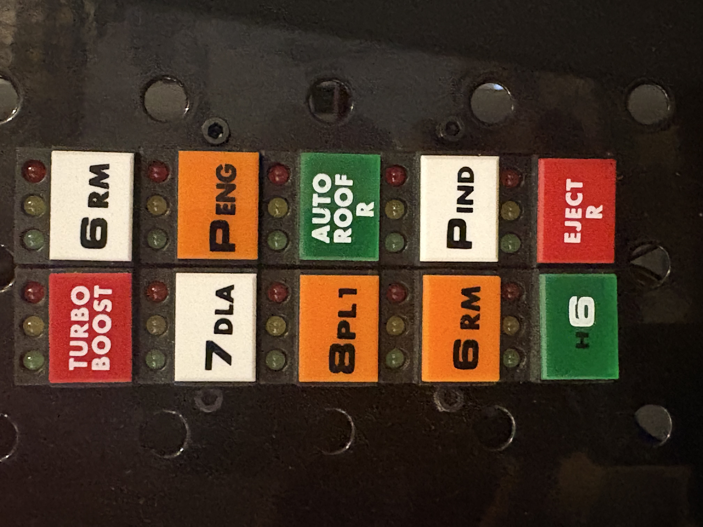
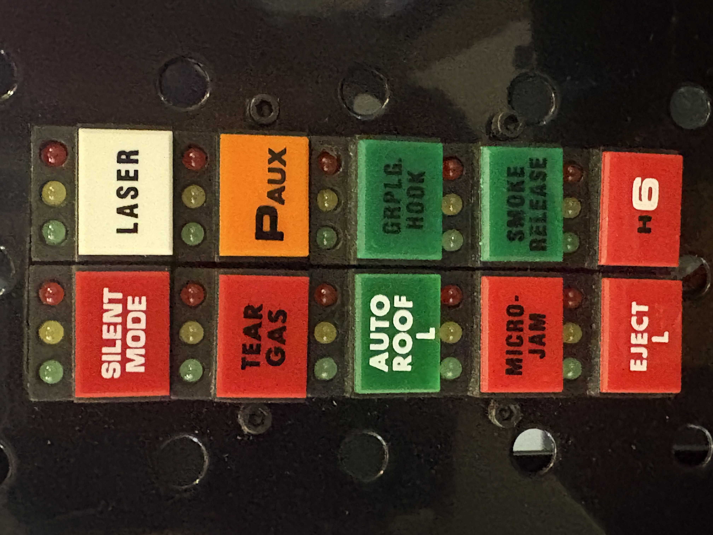

# What the dashboard is actually telling you

The dash carries KITT's original season 2 labels — inlet temperature, hydraulic
system stress, propagation delay. None of them mean what they say. This is the
decoder ring.

The reference image is [`karr/design/s2-dash.png`](../karr/design/s2-dash.png),
a high-resolution scan of the season 2 panel that this hardware reproduces.

Letters in parentheses are the board's serial address — see
[README.md](README.md) for the protocol and [`panp/panp.py`](panp/panp.py) for
the code.

## Speedo cluster (B)

| KITT label | Brewery value |
| --- | --- |
| `MPH`, 3 digits | **HLT temperature**, °F, rounded to whole degrees |
| bargraph above `MPH` | the same HLT temperature, 2 °F per LED |
| `000.0`, 4 digits | **the selected value** — whatever the left switch pod last chose |
| 16-LED bargraph above it | the same selected value, scaled to its own range |
| `GUIDANCE`, `SYST. RDY` | unused |
| alphanumeric row | the message center — see below |

The lower display is the multi-function one. What it shows, and the scale the
bargraph uses, both depend on the left switch pod:

| Showing | Bargraph spans | Decimal |
| --- | --- | --- |
| mash tun temperature | 110 °F upward, 5 °F per LED | `000.0` |
| HLT temperature | 110 °F upward, 5 °F per LED | `000.0` |
| unitank 1, unitank 2 or chronical temperature | 34 °F upward, 3 °F per LED | `000.0` |
| any of those three gravities | 1.000 upward, 0.0004 per LED | `0.000` |

## Tacho cluster (A)

| KITT label | Brewery value |
| --- | --- |
| `kRPM`, 2 digits | **the selected keezer or lager temperature**, °F |
| the RPM arc | the same value again, as a sweep from 2 °F to 80 °F |
| `INLET TEMP` | keezer probe 1 |
| `MASS FLOW LBS` | keezer probe 2 |
| `FUEL FLOW GPH` | keezer probe 3 |
| `FREE TURBINE` | keezer probe 4 |
| `E.G.T. °F` | keezer probe 5 |
| `MAIN OIL PRESS` | keezer probe 6 |

The six bargraphs always show all six keezer probes, whatever the digits are
set to. Each bar spans 30 °F to 51 °F: solidly green is a keezer at serving
temperature, red at the top end is too warm. Because the fan is off you can
watch the keezer stratify across the six.

The probe-to-bar correspondence is positional — `panp.py` sends the six probes
in the order they appear in `keezer_probes`, and the board lights bars 1–6 in
its own fixed order. The mockup in
[`karr/design/rpm-labels.png`](../karr/design/rpm-labels.png) assumes that runs
down the left column and then down the right, as the table above does. If a
probe ever shows up on the wrong bar, reorder `keezer_probes` rather than the
serial message.

## Dummy6 (G)

| KITT label | Brewery value |
| --- | --- |
| `COMPRESSOR TEMP °F` | lager keg 1 temperature |
| `HYD SYST STRESS PSI` | lager keg 2 temperature |
| `VOLTS DC` | lager keg 3 temperature |
| `CAPACITY STATUS` | **total beer on tap** — `E` is dry, `FULL` is four 5 gal kegs plus the 2.5 gal cask |
| `PROPAGATION DELAY HRS` | keg 1 remaining |
| `ACCESS` | keg 2 remaining |

The top three are the red/green bars, which suits a lagering temperature: one
green segment is 30 °F, half-degree steps up from there. The bottom three are
all red, which suits a volume.

`CAPACITY STATUS` keeping its own name is the one honest label on the dash.

## Dummy3 left, all red (E)

| KITT label | Brewery value |
| --- | --- |
| `APPROACH WARNING SEC` | keg 3 remaining |
| `RADAR WATTS KW` | keg 4 remaining |
| `SENSOR RANGE` | keg 5 remaining |

Volumes come from the RaspberryPints database as a percentage of each keg's
starting volume, refreshed every tenth pass of the loop.

## Dummy3 right, red/green (F)

| KITT label | Brewery value |
| --- | --- |
| `FUEL GALLONS` | unitank 1 temperature |
| `MI / GALLONS` | unitank 2 temperature |
| `RANGE ESTIMATES` | chronical temperature |

Each bar spans 30 °F to 76 °F, so a fermenter holding its setpoint sits in the
green and a crash or a runaway shows as red.

## Message center (C)

In **Norm** and **Pursuit** it captions the lower speedo display: `DEG F MASH`,
`SG UTK1`, and so on, so you know what the `000.0` refers to. Pressing a flow
meter button interrupts it with `FLOW n on` for a second.

In **Auto** the rest of the dash is powered down and the message center stays
lit on its own, showing `BREWPI UP` and, if any flow meters are running, which
ones.

## PANP

| Button | Effect |
| --- | --- |
| `POWER` | not software — a relay held closed while both Pis are up, so the dash cannot be cut without halting them first |
| `AUTO` | dash off, message center still lit |
| `NORM` | dash on, dimmed |
| `PURSUIT` | dash on, full brightness |

Pressing one of these on the rpints Pi also signals the brewpi Pi over GPIO, so
both halves of the dash change together.

## Switch pods

Swapping the button legends is a Knight Rider tradition, so these differ from
the panel scan. The pods are wired as a resistive ladder read by an Arduino,
which reports a position 0–9; even positions are the left column top to bottom,
odd positions the right column. See [switchpod/README.md](switchpod/README.md).

### Right pod — picks what the tacho shows

| Button | Pos | Shows on `kRPM` and the arc |
| --- | --- | --- |
| `TURBO BOOST` | 0 | keezer probe 1 |
| `7 DLA` | 2 | keezer probe 2 |
| `8 PL1` | 4 | keezer probe 3 |
| `6 RM` (orange) | 6 | keezer probe 4 |
| `H6` | 8 | keezer probe 5 |
| `6 RM` (white) | 1 | keezer probe 6 |
| `P ENG` | 3 | lager keg 1 |
| `AUTO ROOF R` | 5 | lager keg 2 |
| `P IND` | 7 | lager keg 3 |
| `EJECT R` | 9 | mean of the six keezer probes |

There are two `6 RM` buttons; the white one at the top of the right column is
probe 6, the orange one in the left column is probe 4.

### Left pod — picks what the speedo and message center show

| Button | Pos | Action |
| --- | --- | --- |
| `SILENT MODE` | 0 | mash tun temperature |
| `TEAR GAS` | 2 | HLT temperature |
| `AUTO ROOF L` | 4 | unitank 1 — press again to swap temperature and gravity |
| `MICRO-JAM` | 6 | unitank 2 — likewise |
| `EJECT L` | 8 | chronical — likewise |
| `LASER` | 1 | toggle flow meter 1 |
| `PAUX` | 3 | toggle flow meter 2 |
| `GRPLG. HOOK` | 5 | toggle flow meter 3 |
| `SMOKE RELEASE` | 7 | toggle flow meter 4 |
| `H6` | 9 | toggle flow meter 5 |

The left column selects a display; the right column switches relays. Both pods
have an `H6`, on opposite sides and in different colours.

## Not this

[`karr/design/`](../karr/design/) also contains mockups
(`mph-labels.png`, `rpm-labels.png`, `lower-labels.png`) with brewery labels
drawn over the gauges. Those belong to the shelved ESP32 rebuild and assign
things differently — `MPH` as unitank temperature, the tacho bars as kegs 1–5
plus the line. They are a design sketch, not a description of the running
system. This file is.
